# AFE Learning App — Complete Developer Guide

> **Amazon Future Engineers (AFE) Offline Learning App**
> A production-grade, installer-first Electron desktop application for offline-first student education on shared Windows laptops.

---

## Table of Contents

1. [Project Overview](#1-project-overview)
2. [Technology Stack](#2-technology-stack)
3. [Horizontal Overview — All Packages at a Glance](#3-horizontal-overview--all-packages-at-a-glance)
4. [App Architecture (Mermaid)](#4-app-architecture)
5. [Database Architecture (Mermaid)](#5-database-architecture)
6. [Getting Started — Developer Setup](#6-getting-started--developer-setup)
7. [Deep Dive: `apps/desktop` — The Electron Main Process](#7-deep-dive-appsdesktop--the-electron-main-process)
8. [Deep Dive: `apps/renderer` — The React Frontend](#8-deep-dive-appsrenderer--the-react-frontend)
9. [Deep Dive: `packages/shared` — The Contract Layer](#9-deep-dive-packagesshared--the-contract-layer)
10. [Deep Dive: `packages/backend/db` — Database Layer](#10-deep-dive-packagesbackenddb--database-layer)
11. [Deep Dive: `packages/backend/content-engine` — Content Management](#11-deep-dive-packagesbackendcontent-engine--content-management)
12. [Deep Dive: `packages/backend/ai-tutor` — AI Tutor (Ollama)](#12-deep-dive-packagesbackendai-tutor--ai-tutor-ollama)
13. [Deep Dive: `packages/backend/analytics` — Analytics & Sync](#13-deep-dive-packagesbackendanalytics--analytics--sync)
14. [Deep Dive: `packages/backend/stt-engine` — Speech-to-Text](#14-deep-dive-packagesbackendstt-engine--speech-to-text)
15. [Deep Dive: `packages/backend/tts-engine` — Text-to-Speech](#15-deep-dive-packagesbackendtts-engine--text-to-speech)
16. [IPC Communication — Complete Channel Reference](#16-ipc-communication--complete-channel-reference)
17. [User Flow — Decision Trees](#17-user-flow--decision-trees)
18. [Data Flow Diagrams](#18-data-flow-diagrams)
19. [Installer & Deployment](#19-installer--deployment)
20. [Environment Variables & Configuration](#20-environment-variables--configuration)
21. [Common Developer Tasks](#21-common-developer-tasks)
22. [Troubleshooting](#22-troubleshooting)

---

## 1. Project Overview

### What is AFE?

AFE (Amazon Future Engineer) is an **offline-first Learning Management System (LMS)** built for students with **limited or zero internet connectivity**. It runs as a Windows desktop application on shared laptops deployed to underserved communities by NGOs.

### Core Mission

Deliver high-quality educational content (videos, PDFs, interactive quizzes) through a secure, resilient desktop app that:
- Works **100% offline** — no internet required after installation
- Supports **multiple students** on a single device (shared laptop model)
- Provides an **AI-powered tutor** for conversational learning (via local Ollama inference)
- Features **speech-to-text (STT)** and **text-to-speech (TTS)** for voice-based interactions
- Automatically **syncs learning data** to a central RMS (Remote Management System) server when connectivity is available

### Key Constraints

| Constraint | Detail |
|---|---|
| **Offline-First** | Must function 100% without internet |
| **Windows Only** | Primary target: Windows 10/11 (x64) |
| **Shared Devices** | Multiple students per device, data must persist across user accounts |
| **Low-End Hardware** | Must run snappily on basic laptops |
| **No Runtime Installation** | All assets baked into installer, no code downloaded at runtime |
| **Data Survives Reinstalls** | Data stored in `C:\ProgramData\OfflineLearningApp\`, not in user profile |

---

## 2. Technology Stack

| Layer | Technology | Purpose |
|---|---|---|
| **Monorepo** | pnpm Workspaces | Multi-package management |
| **Desktop Framework** | Electron v28+ | Cross-process app shell |
| **Frontend** | React 18 + Vite + TypeScript | UI layer (Renderer Process) |
| **Styling** | TailwindCSS (Neo-Brutalism) | Bold, chunky UI aesthetic |
| **Database** | SQLite via `better-sqlite3` | Local file-based persistence |
| **ORM** | Drizzle ORM | Type-safe queries + auto-migrations |
| **AI Inference** | Ollama (qwen2.5:1.5b) | Local LLM for AI tutoring |
| **Speech-to-Text** | Whisper.cpp | Offline transcription |
| **Text-to-Speech** | Piper (ONNX) | Offline voice synthesis |
| **Content Validation** | Zod | JSON manifest schema validation |
| **Installer** | electron-builder (NSIS) | Windows installer with silent `/S` support |
| **IPC** | Electron IPC (`contextBridge`) | Secure main ↔ renderer communication |

---

## 3. Horizontal Overview — All Packages at a Glance

```
AFE/
├── apps/
│   ├── desktop/           # Electron main process (The Brain)
│   └── renderer/          # React frontend (The Face)
├── packages/
│   ├── shared/            # TypeScript types, IPC contracts, constants
│   └── backend/
│       ├── db/            # SQLite + Drizzle ORM (12 tables)
│       ├── content-engine/# JSON manifest loader + Zod validation
│       ├── ai-tutor/      # Ollama LLM integration (text + voice)
│       ├── analytics/     # Event tracking + daily sync to RMS
│       ├── stt-engine/    # Whisper.cpp speech-to-text
│       └── tts-engine/    # Piper ONNX text-to-speech
├── dev-data/              # Local dev data (DB, manifest, config)
├── installer-assets/      # Files bundled into installer
└── pnpm-workspace.yaml
```

### Package Comparison Matrix

| Package | npm Name | Role | Key Tech | Depends On | Used By |
|---|---|---|---|---|---|
| `apps/desktop` | `desktop` | Main process: lifecycle, IPC, system access | Electron, Node.js | All `@backend/*`, `@afe/shared` | Entry point |
| `apps/renderer` | `renderer` | UI: pages, components, routing | React, Vite, TailwindCSS | `@afe/shared` (types only) | End user |
| `packages/shared` | `@afe/shared` | Types, constants, IPC contracts | TypeScript | None | Everyone |
| `packages/backend/db` | `@backend/db` | Database schema, queries, migrations | SQLite, Drizzle ORM | `@afe/shared` | `desktop`, `ai-tutor`, `analytics` |
| `packages/backend/content-engine` | `@backend/content-engine` | Load + validate content manifest | Zod, Node fs | None | `desktop`, `ai-tutor` |
| `packages/backend/ai-tutor` | `@backend/ai-tutor` | LLM chat, summaries, voice streaming | Ollama SDK | `@backend/db`, `@backend/content-engine`, `@afe/shared` | `desktop` |
| `packages/backend/analytics` | `@backend/analytics` | Event tracking, daily snapshots, sync | — | `@backend/db`, `@backend/ai-tutor`, `@afe/shared` | `desktop` |
| `packages/backend/stt-engine` | `@backend/stt-engine` | Push-to-talk → text transcription | Whisper.cpp (binary) | None | `desktop` |
| `packages/backend/tts-engine` | `@backend/tts-engine` | Text → speech audio generation | Piper (ONNX binary) | None | `desktop` |

### Dependency Graph

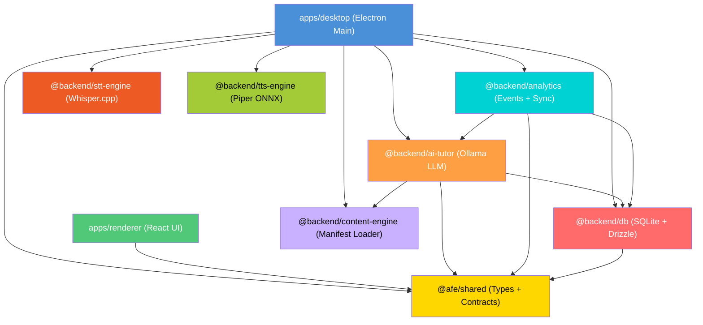

---

## 4. App Architecture

### High-Level Architecture

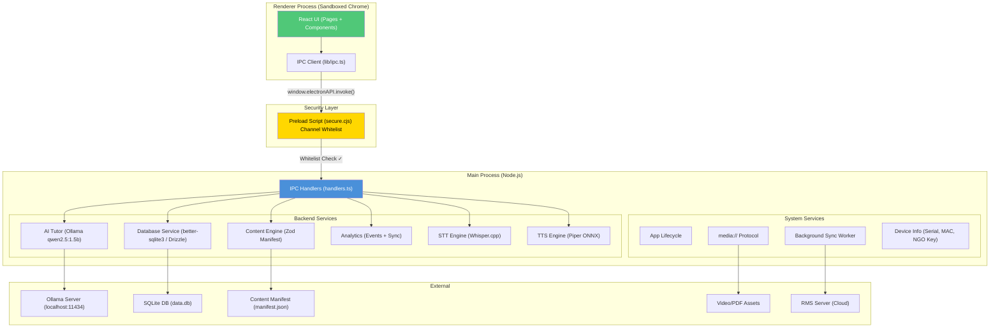

### The "Two Worlds" of Electron

Electron runs two **isolated process types**:

| Process | Environment | Can Do | Cannot Do |
|---|---|---|---|
| **Main Process** (Node.js) | Full Node.js | Database writes, file system, AI inference, spawn processes | Render HTML/CSS |
| **Renderer Process** (Chrome) | Sandboxed browser | Render React UI, handle user events | Access `fs`, `require()`, Node APIs |

**Why this matters:** If the Renderer had `nodeIntegration: true`, a compromised dependency could execute `fs.unlinkSync('C:\\Windows\\System32\\...')`. Our architecture prevents this by:
1. Setting `nodeIntegration: false` and `contextIsolation: true`
2. Using a **Preload Script** (`secure.cjs`) as a whitelist gateway
3. Exposing only `window.electronAPI.invoke(channel, data)` to the renderer

---

## 5. Database Architecture

### Entity-Relationship Diagram

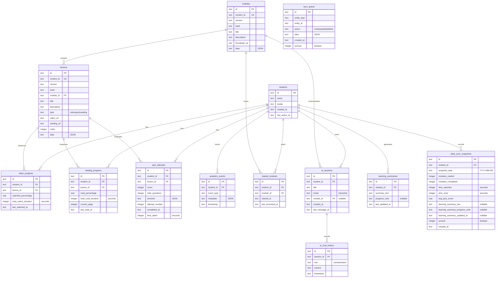

### Table Summary

| Table | Purpose | Key Fields | Cascade? |
|---|---|---|---|
| `students` | Student profiles (multi-student per device) | `id (UUID)`, `name`, `avatar (emoji)` | — |
| `modules` | Cached content modules from manifest | `id`, `content_id`, `title`, `data (JSON)` | — |
| `lessons` | Cached lessons → `modules` (FK) | `type: video\|quiz\|reading`, `order` | — |
| `video_progress` | Per-student video watch tracking | `watched_percentage`, `total_watch_duration` | `ON DELETE CASCADE` |
| `reading_progress` | Per-student PDF reading tracking | `read_percentage`, `current_page` | `ON DELETE CASCADE` |
| `quiz_attempts` | Quiz attempt history with graded answers | `score`, `total_questions`, `answers (JSON)` | `ON DELETE CASCADE` |
| `analytics_events` | Append-only event log | `event_type`, `metadata (JSON)` | `ON DELETE CASCADE` |
| `started_modules` | Which modules each student has started | Unique index: `(student_id, module_id)` | `ON DELETE CASCADE` |
| `ai_sessions` | AI chat sessions (tutor or general chat) | `mode: tutor\|chat`, `module_id` (optional FK) | `ON DELETE CASCADE` |
| `ai_chat_history` | Message history per AI session | `role: user\|assistant`, `content` | `ON DELETE CASCADE` |
| `learning_summaries` | AI-generated learning summaries (refreshed every 10 days) | `summary_text`, `progress_note` | `ON DELETE CASCADE` |
| `daily_sync_snapshots` | Daily aggregated metrics for RMS sync | Unique: `(student_id, snapshot_date)` | `ON DELETE CASCADE` |
| `sync_queue` | Legacy queue for future entity-level sync | `entity_type`, `action`, `synced` | — |

### Database Configuration

- **Engine:** `better-sqlite3` (synchronous C-binding, high performance)
- **Pragmas:** `journal_mode = WAL` (better concurrency), `foreign_keys = ON`
- **ORM:** Drizzle ORM with auto-migrations from `packages/backend/db/drizzle/` folder
- **Singleton Pattern:** One DB connection per app lifecycle via `getDatabase()`
- **Location:**
  - **Production:** `C:\ProgramData\OfflineLearningApp\data.db`
  - **Development:** `{repo}/dev-data/data.db`

---

## 6. Getting Started — Developer Setup

### Prerequisites

| Requirement | Version | Notes |
|---|---|---|
| **Node.js** | v20 LTS+ | Runtime |
| **pnpm** | v9+ | Package manager |
| **Git** | Latest | Version control |
| **Ollama** | Latest (optional) | For AI tutor features. [Download](https://ollama.com) |
| **Windows** | 10/11 (x64) | Target platform |
| **C++ Build Tools** | VS Build Tools | For `better-sqlite3` native compilation |

### Step-by-Step Setup

```powershell
# 1. Clone the repository
git clone <repository-url>
cd AFE

# 2. Install all dependencies (pnpm resolves workspace:* links)
pnpm install

# 3. Build all packages (compiles TypeScript to dist/)
pnpm build

# 4. (Optional) Set up Ollama for AI features
ollama pull qwen2.5:1.5b    # Main tutor model
ollama pull qwen2.5:0.5b    # Session title generation model

# 5. Start development mode
pnpm dev
```

### What `pnpm dev` Does

1. **Renderer:** Starts Vite dev server on `http://localhost:5173` (hot reload)
2. **Desktop:** Compiles TypeScript, copies preload script, launches Electron
3. Electron loads `http://localhost:5173` and opens DevTools

### Environment Variables

Create `apps/desktop/.env`:

```env
CENTRALIZED_SERVER_URL='http://localhost:3000/api/afe'
```

### Data Directory Mapping

| Environment | Data Root | Content | Database |
|---|---|---|---|
| **Development** | `{repo}/dev-data/` | `dev-data/content/manifest.json` | `dev-data/data.db` |
| **Production** | `C:\ProgramData\OfflineLearningApp\` | `content\manifest.json` | `data.db` |

---

## 7. Deep Dive: `apps/desktop` — The Electron Main Process

### Structure

```
apps/desktop/
├── src/
│   ├── main/
│   │   ├── index.ts          # App entry point (lifecycle + initialization)
│   │   ├── paths.ts          # Data directory path resolution
│   │   ├── content-sync.ts   # Sync manifest.json → SQLite tables
│   │   └── device-info.ts    # Serial number, MAC address, NGO key
│   ├── preload/
│   │   └── secure.cjs        # Context bridge (whitelist gateway)
│   └── ipc/
│       └── handlers.ts       # All IPC handlers (467 lines, 30+ channels)
├── electron-builder.config.js # Installer configuration
├── .env                       # Environment variables
└── package.json
```

### Initialization Sequence

The `initialize()` function in `index.ts` executes this sequence on app start:

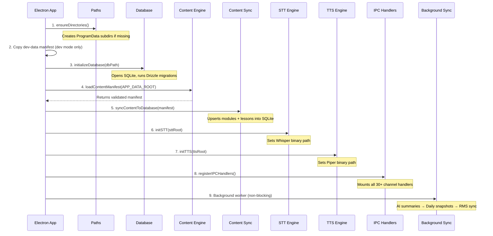

### The Preload Script (`secure.cjs`)

This is the **security gatekeeper** between the untrusted renderer and the trusted main process.

**Key design decisions:**
- Uses **CommonJS** (`.cjs`) — Electron's sandbox is most reliable with CJS
- Uses `contextBridge.exposeInMainWorld` to inject `window.electronAPI`
- **Channel Whitelist:** Only 40+ predefined channels are allowed; any unknown channel throws an error

**Exposed API:**

```javascript
window.electronAPI = {
    invoke(channel, data),   // Request/response (ipcMain.handle)
    send(channel, data),     // Fire-and-forget (ipcMain.on)
    on(channel, callback),   // Listen for events from main
    stt: {
        start(), stop(), sendChunk(chunk),
        onPartial(cb), onFinal(cb)
    },
    tts: {
        speak(text), stop(), isAvailable()
    }
}
```

### Custom `media://` Protocol

The desktop app registers a custom protocol for serving video/PDF assets:

```
media://assets/videos/intro.mp4  →  C:\ProgramData\OfflineLearningApp\assets\videos\intro.mp4
```

**Security:** Path-traversal prevention ensures only files under `PATHS.ASSETS_DIR` are served.

### Device Information (`device-info.ts`)

Collects hardware identifiers for RMS sync:
- **Serial Number:** `wmic bios get serialnumber` (Windows)
- **MAC Address:** From `os.networkInterfaces()` (first non-internal)
- **NGO Key:** From `config.json` file (defaults to `D3F41T-K37`)

---

## 8. Deep Dive: `apps/renderer` — The React Frontend

### Structure

```
apps/renderer/src/
├── main.tsx                    # React entry point (BrowserRouter)
├── App.tsx                     # Route definitions
├── env.d.ts                    # TypeScript declarations for window.electronAPI
├── lib/
│   └── ipc.ts                  # Type-safe IPC client (IPCClient class)
├── pages/
│   ├── BeginLearning.tsx       # Landing page: student selection + creation
│   ├── AvatarSelection.tsx     # Choose avatar (animal emojis)
│   ├── StudentDashboard.tsx    # Progress overview + analytics stats
│   ├── ModuleList.tsx          # Grid of available learning modules
│   ├── ModuleDetail.tsx        # Lessons within a module
│   ├── AILearningCenter.tsx    # Full AI tutor interface
│   ├── useStreamingSTT.ts      # React hook: push-to-talk voice input
│   └── useVoiceMode.ts         # React hook: voice conversation mode
├── components/
│   ├── AITutor.tsx             # Floating AI chat widget
│   ├── VideoPlayer.tsx         # Video player with progress tracking
│   ├── PDFViewer.tsx           # PDF reader with page/time tracking
│   ├── QuizViewer.tsx          # Interactive quiz with grading
│   ├── VoiceOrb.tsx            # Animated voice interaction orb
│   └── VoiceOrb.css            # VoiceOrb animation styles
└── styles/
    └── index.css               # Global Neo-Brutalism theme
```

### Route Map

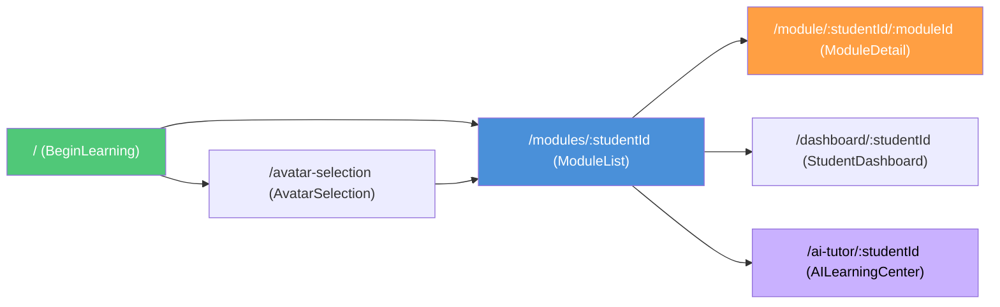

### Page Descriptions

| Page | Route | Purpose | Key IPC Calls |
|---|---|---|---|
| **BeginLearning** | `/` | Landing page. Shows existing students or "Begin Journey" CTA | `ipc.getAllStudents()`, `ipc.updateStudentLastActive()` |
| **AvatarSelection** | `/avatar-selection` | Pick name + animal emoji avatar for new student | `ipc.createStudent(name, avatar)` |
| **ModuleList** | `/modules/:studentId` | Grid of all learning modules with progress indicators | `ipc.getModules()`, `ipc.getStartedModules()` |
| **ModuleDetail** | `/module/:studentId/:moduleId` | Lists lessons in a module; opens video/quiz/PDF viewers | `ipc.getModuleById()`, `ipc.markModuleStarted()` |
| **StudentDashboard** | `/dashboard/:studentId` | Analytics overview: watch time, quiz scores, module progress | `ipc.getAnalyticsSummary()` |
| **AILearningCenter** | `/ai-tutor/:studentId` | Full-featured AI tutor with text + voice modes | `ipc.sendAIMessage()`, `ipc.sendAIVoiceMessage()` |

### The IPC Client (`lib/ipc.ts`)

A **singleton class** that wraps `window.electronAPI.invoke()` with type-safe methods:

```typescript
import { ipc } from '../lib/ipc';

// All calls are type-checked against @afe/shared contracts
const students = await ipc.getAllStudents();    // Returns Student[]
const module = await ipc.getModuleById('m1');   // Returns Module | null
await ipc.updateVideoProgress(studentId, lessonId, 85.5, 300);
```

The IPC Client provides **40+ methods** organized into:
- Student operations (CRUD)
- Content operations (get modules/lessons)
- Progress tracking (video, reading, started modules)
- Quiz operations (submit, get attempts, best score)
- Analytics (track event, get summary)
- AI Tutor (send message, sessions CRUD, history)
- Voice pipeline (voice message, TTS sentence ready listener)
- STT (start/stop/chunk/onFinal)
- TTS (speak, stop, isAvailable)

### Key Components

| Component | Purpose | Key Feature |
|---|---|---|
| **VideoPlayer** | Plays lesson videos via `media://` protocol | Tracks `watchedPercentage` and `totalWatchDuration`, saves progress every 5 seconds |
| **PDFViewer** | Renders PDF lessons | Tracks `readPercentage`, `currentPage`, and `totalReadDuration` |
| **QuizViewer** | Interactive multiple-choice quizzes | Server-side grading, tracks `attemptNumber` and `timeTaken` |
| **AITutor** | Floating chat widget (available on all pages) | Streaming responses via `onAIStreamChunk` listener |
| **VoiceOrb** | Animated orb for voice interactions | CSS animations for recording/speaking/idle states |

---

## 9. Deep Dive: `packages/shared` — The Contract Layer

### Purpose

The **single source of truth** for TypeScript types shared between the frontend and backend. This ensures **full-stack type safety** — if you change a field name in a type, both sides fail at compile time.

### Structure

```
packages/shared/src/
├── index.ts              # Barrel export
├── constants.ts          # App name, data paths, avatars, quiz/video config
├── sync-types.ts         # DeviceInfo, SyncSnapshot, SyncPayload
├── types/
│   └── index.ts          # Student, Module, Lesson, QuizData, Progress types
└── ipc/
    └── contracts.ts      # IPC_CHANNELS enum + request/response type pairs
```

### IPC Contract System

Every IPC channel has a **typed contract**:

```typescript
// The channel name
IPC_CHANNELS.STUDENT_CREATE = 'student:create'

// The request type
StudentCreateRequest = { name: string; avatar: string }

// The response type
StudentCreateResponse = Student

// The contract map (used for type inference)
IPCContract['student:create'] = {
    request: StudentCreateRequest;
    response: StudentCreateResponse;
}
```

This pattern enables the `IPCClient` in the renderer to be fully type-safe without importing any backend code.

---

## 10. Deep Dive: `packages/backend/db` — Database Layer

### Structure

```
packages/backend/db/src/
├── index.ts              # Barrel export (re-exports everything)
├── core.ts               # getDatabase() singleton + initializeDatabase()
├── schema/
│   └── index.ts          # All 12 Drizzle table definitions
├── services/
│   ├── students.ts       # createStudent, getAllStudents, getStudentById, etc.
│   └── progress.ts       # video/reading progress + quiz attempts + started modules
└── exports.ts            # Re-exports Drizzle utilities (eq, and, or, sql, etc.)
```

### Database Initialization Flow

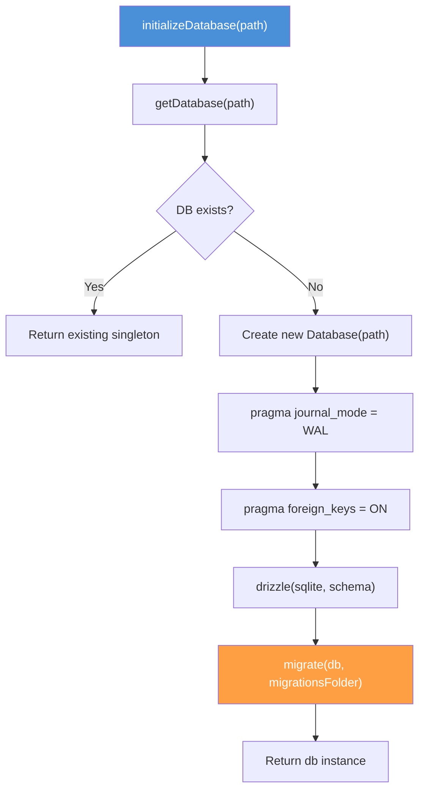

### Key Service Functions

**Students:**
- `createStudent(name, avatar)` → Generates UUID, saves with timestamp
- `getAllStudents()` → Returns all student profiles
- `updateStudentLastActive(id)` → Updates `last_active_at`

**Progress:**
- `updateVideoProgress(studentId, lessonId, %, duration)` → Upserts watch data
- `updateReadingProgress(studentId, lessonId, %, duration, page)` → Upserts read data
- `submitQuizAttempt(studentId, lessonId, score, total, answers, time)` → Creates new attempt
- `markModuleStarted(studentId, moduleId)` → Upserts with unique constraint

---

## 11. Deep Dive: `packages/backend/content-engine` — Content Management

### How Content Works

Content is defined in a `manifest.json` file — a JSON document describing all modules and lessons with references to static assets (MP4 videos, PDFs).

### Manifest Schema (Zod)

```
manifest.json
├── modules[]
│   ├── id, contentId, version, hash
│   ├── title, description, thumbnailUrl
│   └── lessons[]
│       ├── id, contentId, version, hash
│       ├── title, description, order
│       ├── type: "video" | "quiz" | "reading"
│       ├── videoUrl? (relative path to MP4)
│       ├── readingUrl? (relative path to PDF)
│       └── quizData? { questions[], passingScore }
```

### Content Sync to Database

On every app start, `content-sync.ts` upserts manifest data into the SQLite `modules` and `lessons` tables using `onConflictDoUpdate`. This ensures:
1. Foreign key constraints are satisfied (progress records reference `lessons.id`)
2. Content updates are reflected immediately
3. Manifest is the **single source of truth** for content

### Key Functions

- `loadContentManifest(basePath)` → Read + Zod validate → return typed `ContentManifest`
- `getModuleById(manifest, id)` → Find module in manifest
- `getLessonById(manifest, id)` → Find lesson across all modules

---

## 12. Deep Dive: `packages/backend/ai-tutor` — AI Tutor (Ollama)

### Architecture

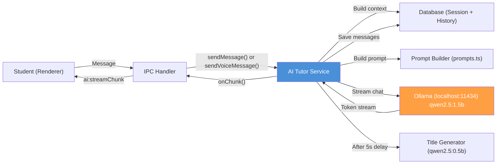

### Two Modes

| Mode | Purpose | System Prompt | Context |
|---|---|---|---|
| **Tutor** | Module-specific learning assistant | `buildSystemPrompt()` — warm, informal, ends with question | Module title injected |
| **Chat** | General Q&A assistant | Generic helpful assistant prompt | None |

### Voice Message Pipeline

The voice pipeline implements **sentence-boundary streaming** for near-real-time speech-to-speech:

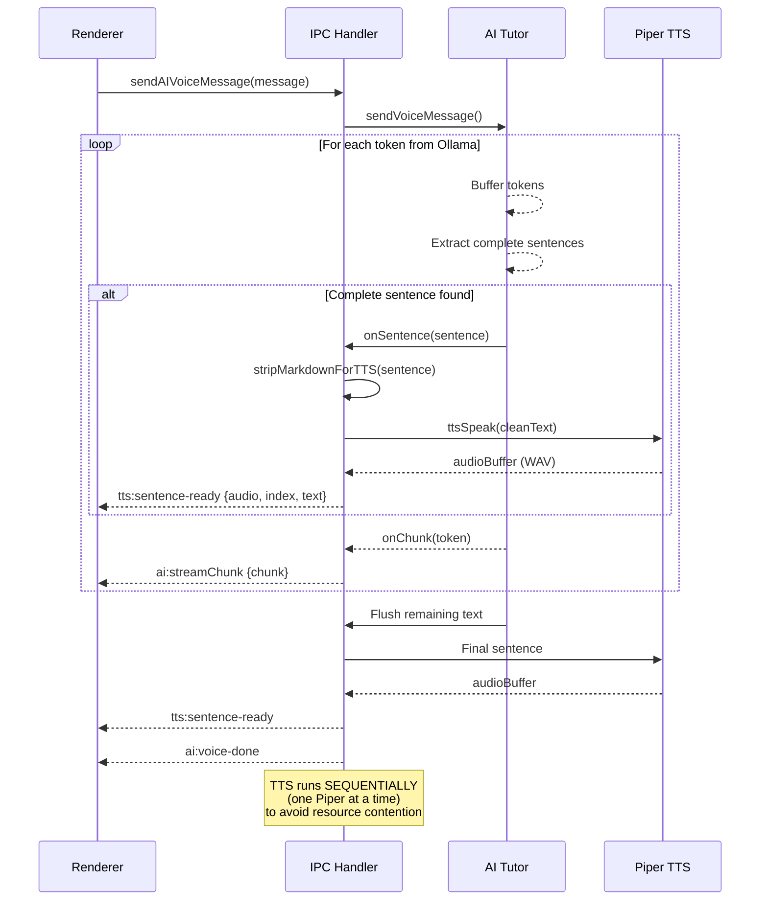

**Key design decisions:**
- **Sequential TTS:** Only one Piper process at a time (each loads a 63MB ONNX model)
- **Playback overlaps synthesis:** Renderer plays sentence N while main process synthesizes sentence N+1
- **Markdown stripping:** Removes `**bold**`, `*italic*`, `# headings`, bullet lists, code blocks before TTS
- **Minimum sentence length:** 10 chars to avoid tiny garbage fragments

### Learning Summary Generation

Every 10 days (configurable via `SUMMARY_REFRESH_DAYS`), the app auto-generates:
1. **Learning Summary** (<300 words) — Analyzes last 50 chat messages
2. **Progress Note** (<100 words) — Compares new summary vs previous one

These summaries are:
- Stored in `learning_summaries` table
- Injected into tutor system prompts for personalized teaching
- Included in daily sync snapshots sent to RMS

---

## 13. Deep Dive: `packages/backend/analytics` — Analytics & Sync

### Analytics Events

All events are **append-only** (inserted into `analytics_events` table):

| Event Type | Triggered When | Metadata |
|---|---|---|
| `video_watched` | Video progress saved | `{ lessonId, watchDuration }` |
| `pdf_read` | Reading progress saved | `{ lessonId, readDuration }` |
| `quiz_completed` | Quiz submitted | `{ lessonId, score, totalQuestions, percentage }` |
| `module_started` | Module first opened | `{ moduleId }` |
| `module_completed` | All lessons complete | `{ moduleId }` |
| `ai_voice_chat` | Voice AI session ends | `{ moduleId, durationSeconds }` |
| `ai_text_chat` | Text AI session ends | `{ moduleId, durationSeconds }` |

### Daily Sync to RMS

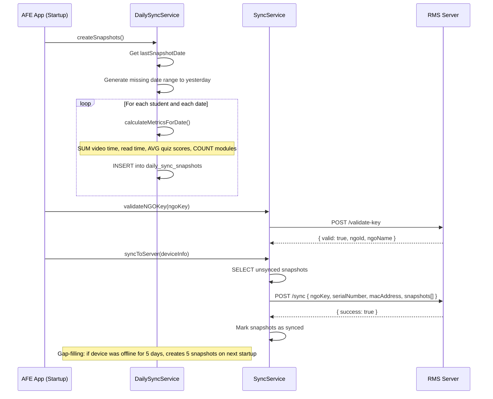

### Sync Payload Structure

```typescript
{
    ngoKey: "AFE-KEY-123",
    serialNumber: "BIOS-SERIAL",
    macAddress: "AA:BB:CC:DD:EE:FF",
    snapshots: [
        {
            studentUuid: "uuid-1",
            studentName: "Mukul",
            snapshotDate: "2026-03-05",
            modulesStarted: 3,
            modulesCompleted: 1,
            timeWatched: 3600,      // seconds
            timeRead: 1800,         // seconds
            avgQuizScore: 85.5,
            learningSummary: {
                text: "Mukul has shown...",
                progressNote: "Since last summary...",
                lastUpdatedAt: "2026-03-01T00:00:00Z"
            }
        }
    ]
}
```

---

## 14. Deep Dive: `packages/backend/stt-engine` — Speech-to-Text

### How It Works

Uses **Whisper.cpp** (a C++ port of OpenAI's Whisper model) for offline speech recognition.

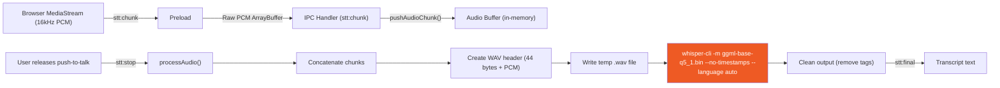

### Key Files

| File | Purpose |
|---|---|
| `whisper-cli.exe` | Pre-compiled Whisper binary (Windows) |
| `whisper.dll` / `SDL2.dll` | Required shared libraries |
| `ggml-base-q5_1.bin` | Quantized Whisper base model (~57MB) |

### Configuration

- **Sample Rate:** 16kHz (PCM, 16-bit, mono)
- **Language:** Auto-detect
- **Threads:** 2 (to avoid CPU saturation on low-end hardware)
- **Buffer Safety:** Max 10,000 chunks before forced reset

---

## 15. Deep Dive: `packages/backend/tts-engine` — Text-to-Speech

### How It Works

Uses **Piper** (an ONNX-based TTS engine) for offline voice synthesis.

| Component | Detail |
|---|---|
| **Binary** | `piper.exe` (pre-compiled) |
| **Voice Model** | ONNX model file (~63MB) |
| **Input** | Plain text (markdown stripped by IPC handler) |
| **Output** | WAV audio buffer returned to renderer as base64 |

### Data Flow

1. IPC handler calls `ttsSpeak(text)`
2. Piper process spawns, loads ONNX model, generates WAV
3. WAV buffer returned to handler
4. Converted to base64 string (to avoid IPC structured-clone corruption)
5. Sent to renderer via `tts:sentence-ready` event
6. Renderer decodes base64 → creates `AudioBuffer` → plays via Web Audio API

---

## 16. IPC Communication — Complete Channel Reference

### Request/Response Channels (via `ipcMain.handle`)

| Channel | Request | Response | Category |
|---|---|---|---|
| `student:create` | `{ name, avatar }` | `Student` | Students |
| `student:getAll` | `void` | `Student[]` | Students |
| `student:getById` | `{ studentId }` | `Student \| null` | Students |
| `student:updateLastActive` | `{ studentId }` | `void` | Students |
| `content:getModules` | `void` | `Module[]` | Content |
| `content:getModuleById` | `{ moduleId }` | `Module \| null` | Content |
| `content:getLessonById` | `{ lessonId }` | `Lesson \| null` | Content |
| `progress:updateVideo` | `{ studentId, lessonId, watchedPercentage, watchDuration }` | `void` | Progress |
| `progress:getVideo` | `{ studentId, lessonId }` | `VideoProgress \| null` | Progress |
| `progress:getAllForStudent` | `{ studentId }` | `VideoProgress[]` | Progress |
| `progress:markModuleStarted` | `{ studentId, moduleId }` | `void` | Progress |
| `progress:getStartedModules` | `{ studentId }` | `StartedModule[]` | Progress |
| `progress:updateReading` | `{ studentId, lessonId, readPercentage, readDuration, currentPage }` | `void` | Progress |
| `progress:getReading` | `{ studentId, lessonId }` | `ReadingProgress \| null` | Progress |
| `progress:getAllReadingForStudent` | `{ studentId }` | `ReadingProgress[]` | Progress |
| `quiz:submitAttempt` | `{ studentId, lessonId, answers[], timeTaken }` | `QuizAttempt` | Quizzes |
| `quiz:getAttempts` | `{ studentId, lessonId }` | `QuizAttempt[]` | Quizzes |
| `quiz:getBestScore` | `{ studentId, lessonId }` | `number \| null` | Quizzes |
| `analytics:trackEvent` | `{ studentId, eventType, metadata }` | `void` | Analytics |
| `analytics:getSummary` | `{ studentId }` | `AnalyticsSummary` | Analytics |
| `ai:sendMessage` | `{ studentId, message, sessionId }` | `{ response }` | AI Tutor |
| `ai:session:getAll` | `{ studentId }` | `AISession[]` | AI Tutor |
| `ai:session:create` | `{ studentId, title, mode, moduleId? }` | `AISession` | AI Tutor |
| `ai:session:delete` | `{ sessionId }` | `void` | AI Tutor |
| `ai:getSessionHistory` | `{ sessionId }` | `AIChatMessage[]` | AI Tutor |
| `ai:clearHistory` | `{ studentId }` | `void` | AI Tutor |
| `ai:voice-message` | `{ studentId, message, sessionId }` | `{ response }` | Voice |
| `tts:speak` | `{ text }` | `{ audio, fallback }` | TTS |
| `tts:stop` | `void` | `void` | TTS |
| `tts:status` | `void` | `{ available }` | TTS |

### Event Channels (Main → Renderer)

| Channel | Data | Purpose |
|---|---|---|
| `ai:streamChunk` | `{ chunk }` | Streaming AI response tokens |
| `ai:session:updated` | `{ sessionId, title }` | Auto-generated session title |
| `tts:sentence-ready` | `{ audio, index, text }` | TTS audio for a completed sentence |
| `ai:voice-done` | `{}` | Voice response fully complete |
| `stt:final` | `text` | Final transcription result |

### Fire-and-Forget Channels (Renderer → Main)

| Channel | Data | Purpose |
|---|---|---|
| `stt:start` | `void` | Begin recording |
| `stt:stop` | `void` | Stop recording + transcribe |
| `stt:chunk` | `ArrayBuffer` | PCM audio chunk |

---

## 17. User Flow — Decision Trees

### Student Login & Navigation

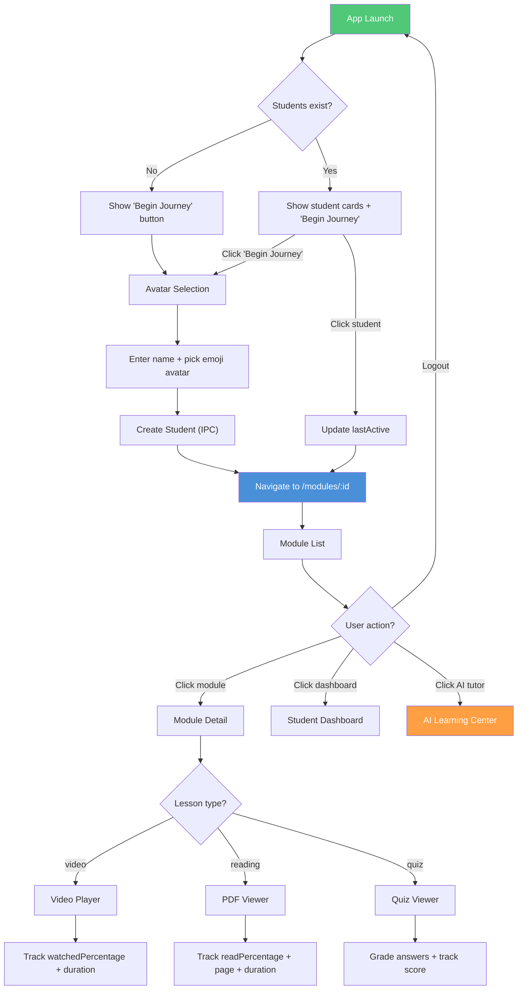

### AI Tutor Interaction

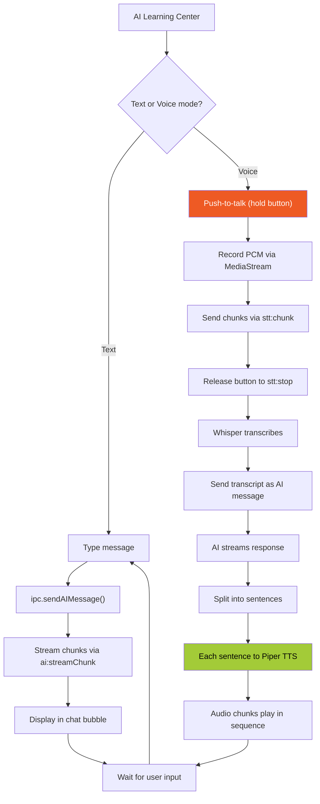

---

## 18. Data Flow Diagrams

### Content Lifecycle

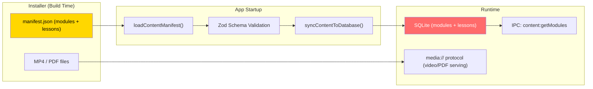

### Analytics Data Pipeline

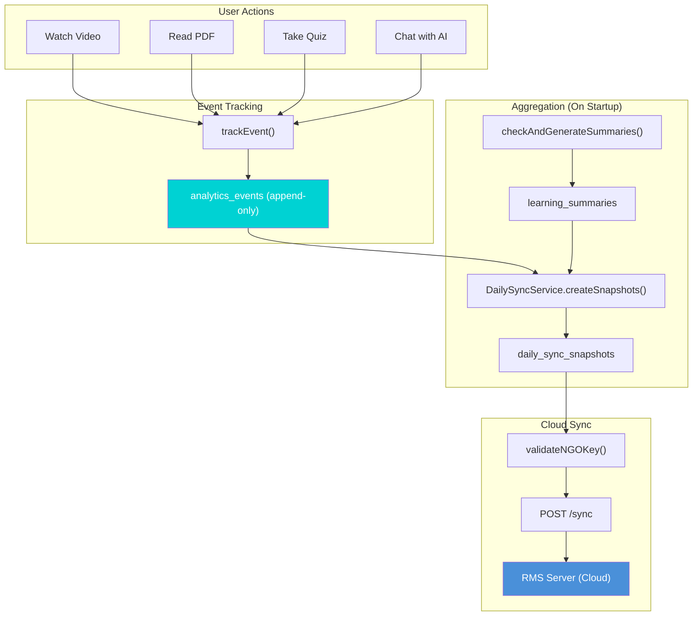

---

## 19. Installer & Deployment

### Electron Builder Configuration

The installer is built using `electron-builder` with NSIS (Nullsoft Scriptable Install System):

| Setting | Value | Purpose |
|---|---|---|
| `appId` | `com.navgurukul.AFE` | Unique app identifier |
| `productName` | `Amazon Future Engineer` | Display name |
| `perMachine` | `true` | System-wide install (not per-user) |
| `installationDirectory` | `C:\Program Files\Offline Learning App` | Fixed install path |
| `deleteAppDataOnUninstall` | `false` | Preserves student data on uninstall |
| `autoUpdate` | `false` | No auto-update (installer-only updates) |

### Build Commands

```powershell
# Build all packages (TypeScript → JavaScript)
pnpm build

# Create Windows installer (.exe)
pnpm build:installer
# Output: apps/desktop/release/Amazon Future Engineer-Setup-1.0.0.exe

# Silent install (enterprise deployment)
"Amazon Future Engineer-Setup-1.0.0.exe" /S
```

### File System Layout (Production)

```
C:\Program Files\Offline Learning App\     # Application code (read-only)
    ├── resources/
    │   ├── app/                           # Electron app bundle
    │   ├── stt/                           # Whisper binary + model
    │   └── tts/                           # Piper binary + voice model
    └── Amazon Future Engineer.exe         # Main executable

C:\ProgramData\OfflineLearningApp\         # Persistent data (survives reinstalls)
    ├── data.db                            # SQLite database
    ├── config.json                        # NGO key
    ├── content/
    │   └── manifest.json                  # Content definition
    ├── assets/
    │   ├── videos/                        # MP4 files
    │   └── avatars/                       # Avatar images
    └── logs/                              # Application logs
```

---

## 20. Environment Variables & Configuration

### `.env` File (`apps/desktop/.env`)

```env
CENTRALIZED_SERVER_URL='http://localhost:3000/api/afe'
```

| Variable | Default | Purpose |
|---|---|---|
| `CENTRALIZED_SERVER_URL` | `http://localhost:3000/api/afe` | RMS server endpoint for data sync |

### `config.json` (Auto-created)

```json
{
    "ngoKey": "D3F41T-K37"
}
```

| Key | Purpose |
|---|---|
| `ngoKey` | Unique key identifying the NGO this device belongs to. Validated with RMS server before syncing. |

### Application Constants (`packages/shared/src/constants.ts`)

| Constant | Value | Purpose |
|---|---|---|
| `QUIZ_SCORING.PASSING_PERCENTAGE` | 70 | Minimum pass score for quizzes |
| `QUIZ_SCORING.MAX_ATTEMPTS` | 5 | Max quiz attempts per student |
| `VIDEO_TRACKING.PROGRESS_UPDATE_INTERVAL` | 5000ms | How often to save video progress |
| `VIDEO_TRACKING.COMPLETION_THRESHOLD` | 90% | What counts as "watched" |
| `SUMMARY_REFRESH_DAYS` | 10 | Days between AI summary regeneration |

---

## 21. Common Developer Tasks

### Adding a New IPC Channel

1. **Define the channel name** in `packages/shared/src/ipc/contracts.ts`:
   ```typescript
   export const IPC_CHANNELS = {
       // ...existing channels
       MY_NEW_CHANNEL: 'myDomain:myAction',
   } as const;
   ```

2. **Add request/response types** in the same file:
   ```typescript
   export type MyNewRequest = { someField: string };
   export type MyNewResponse = { result: boolean };
   ```

3. **Add to IPCContract** interface:
   ```typescript
   [IPC_CHANNELS.MY_NEW_CHANNEL]: {
       request: MyNewRequest;
       response: MyNewResponse;
   };
   ```

4. **Add to preload whitelist** in `apps/desktop/src/preload/secure.cjs`:
   ```javascript
   const VALID_CHANNELS = [
       // ...existing channels
       'myDomain:myAction',
   ];
   ```

5. **Register the handler** in `apps/desktop/src/ipc/handlers.ts`:
   ```typescript
   ipcMain.handle(IPC_CHANNELS.MY_NEW_CHANNEL, async (_event, data) => {
       // Your backend logic
       return { result: true };
   });
   ```

6. **Add client method** in `apps/renderer/src/lib/ipc.ts`:
   ```typescript
   async myNewAction(someField: string) {
       return await this.invoke(IPC_CHANNELS.MY_NEW_CHANNEL, { someField });
   }
   ```

### Adding a New Database Table

1. **Define schema** in `packages/backend/db/src/schema/index.ts`:
   ```typescript
   export const myTable = sqliteTable('my_table', {
       id: text('id').primaryKey(),
       // ...columns
   });
   ```

2. **Generate migration:**
   ```powershell
   cd packages/backend/db
   npx drizzle-kit generate:sqlite
   ```

3. **Build and restart** — migrations run automatically on startup.

### Adding a New Page

1. Create `apps/renderer/src/pages/MyPage.tsx`
2. Add route in `apps/renderer/src/App.tsx`:
   ```tsx
   <Route path="/my-page/:studentId" element={<MyPage />} />
   ```
3. Navigate from other pages: `navigate(`/my-page/${studentId}`)`

---

## 22. Troubleshooting

### Common Issues

| Issue | Cause | Solution |
|---|---|---|
| `Database initialization failed` | Missing C++ build tools | Install VS Build Tools with "Desktop development with C++" |
| `Content manifest not found` | Missing `manifest.json` in dev-data | Copy sample from `installer-assets/content/manifest.json` |
| `Ollama unavailable` | Ollama not running | Start Ollama: `ollama serve` then `ollama pull qwen2.5:1.5b` |
| `STT: Whisper "Bad Magic"` | Incompatible model file | Re-download the model (e.g., `ggml-base.en-q5_1.bin`) from Hugging Face |
| `STT not working` | Missing Whisper binary | Check `packages/backend/stt-engine/whisper-cli.exe` exists |
| `TTS fallback voice` | Piper model not found | Check `packages/backend/tts-engine/` for `.onnx` model file |
| `TTS: Custom model failed` | Missing Piper flags | Ensure `--config` and `--espeak_data` CLI flags are passed for custom ONNX models |
| `IPC blocked unauthorized` | Channel not in whitelist | Add channel to `secure.cjs` `VALID_CHANNELS` array |
| `pnpm install fails` | Wrong Node version | Use Node.js >= 20 LTS |
| `electron-rebuild fails` | Missing native build tools | Install `windows-build-tools` or VS Build Tools |
| `Sync fails` | RMS server unreachable | Set `CENTRALIZED_SERVER_URL` in `.env` or check network |
| `Foreign key constraint` | Content not synced to DB | Ensure manifest loads + `syncContentToDatabase()` runs |

### Debug Tips

1. **DevTools:** Always open in dev mode (`Ctrl+Shift+I`)
2. **Main process logs:** Check terminal where `pnpm dev` runs
3. **Database inspection:** Open `dev-data/data.db` with any SQLite viewer (e.g., DB Browser)
4. **IPC debugging:** Both `secure.cjs` and `handlers.ts` have `console.log` for blocked/received calls

---

> **Built with** ⚡ Electron | ⚛️ React | 🗃️ SQLite | 🤖 Ollama | 🎤 Whisper.cpp | 🔊 Piper | 🎨 Neo-Brutalism
>
> **NavGurukul Team © 2026**
