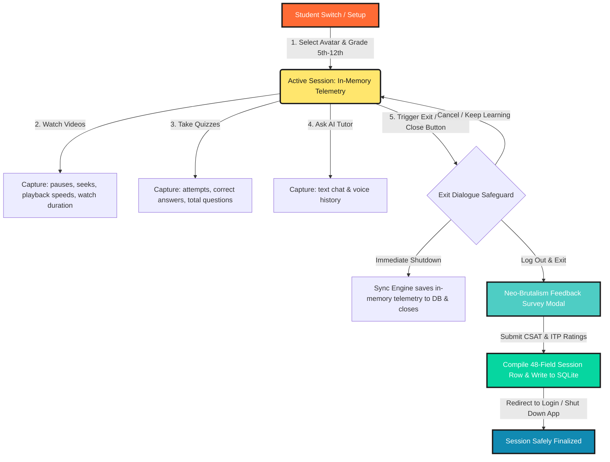
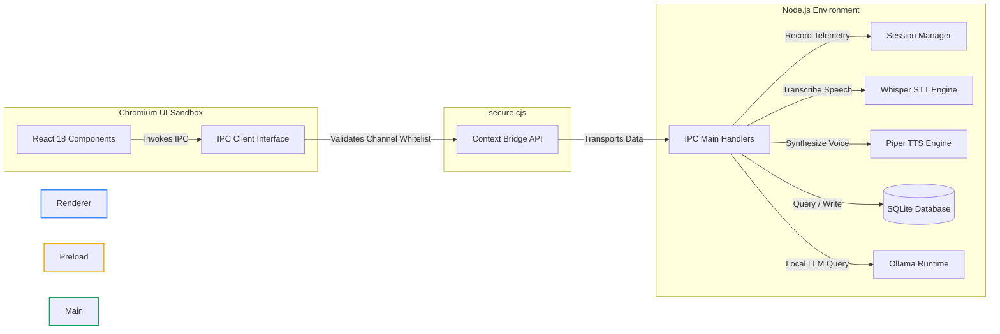
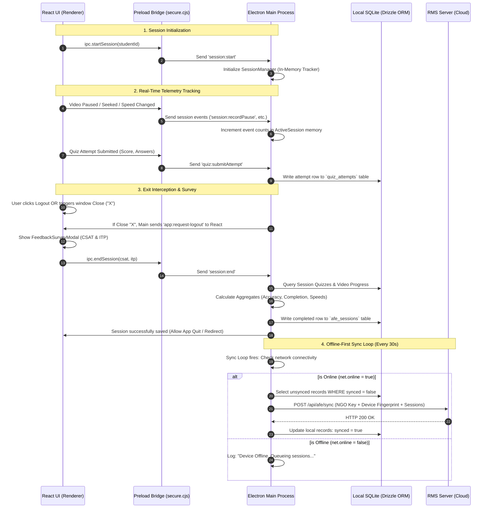
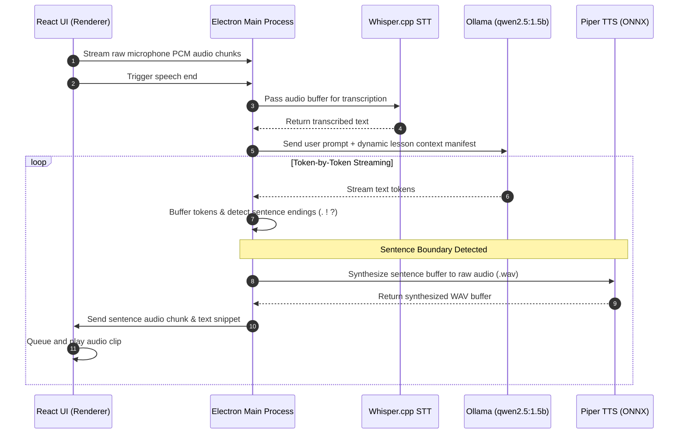
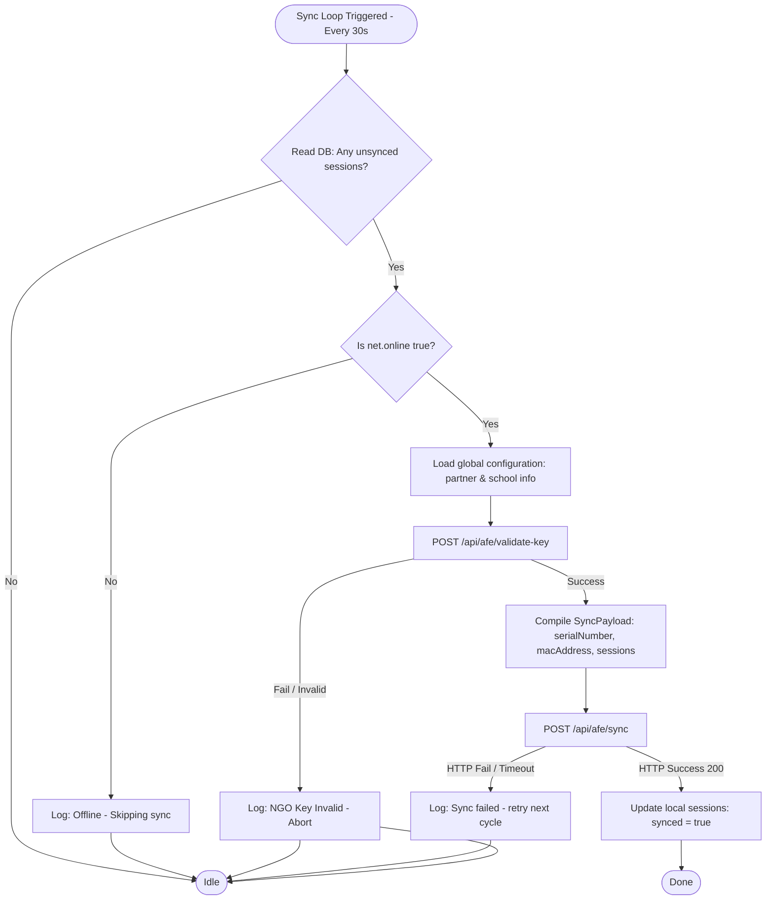

# Amazon Future Engineer (AFE) — Interactive Demo & System Architecture Guide

This document is a comprehensive, presentation-ready guide detailing the system architecture, data models, and features of the **AFE Learning Platform**. It is divided into an **Overview & Demo Guide** (for presentations and stakeholder walkthroughs) and a **Deep Technical Specification** (for engineering and development reference).

---

## 1. 🌟 High-Level Overview (For Demos & Stakeholders)

### 🎯 The Vision
The **AFE Learning Platform** is an enterprise-grade, **offline-first Desktop Application** designed to deliver high-quality computer science education in remote areas, rural community centers, and schools with limited or zero internet connectivity. 

### 💡 Core Value Propositions
*   **100% Offline AI & Content:** The app plays high-definition videos, reads documents, scores quizzes, and runs a fully functional **AI Tutor** (both voice and text) without any internet connection.
*   **Shared Device Multi-Student Isolation:** Because laptops in rural community centers are shared, the app supports multiple local student profiles. Each student switched on gets a custom learning profile, progress tracking, and isolated AI chat history.
*   **Offline-First Individual Tracking:** Aligned with the *AFE Partner Data Collection Guide (Method 2 - Individual Tracking)*, the app tracks student progress at the granular **session level** rather than simple daily aggregate snapshots.
*   **Persistent & Secure:** The local SQLite database and media assets are stored globally in `C:\ProgramData\`, ensuring learning records survive application upgrades, uninstalls, and account resets.

---

### 🎨 The Student Session Lifecycle (Visual Overview)

The diagram below shows how a student interacts with the application from login to logout, how telemetry is generated, and how it is captured securely:



---

## 2. 🔌 Technical Architecture & Data Pipeline

The application uses an isolated **multi-process architecture** built on Electron. By separating the user interface (Renderer) from Node.js capabilities (Main Process), we prevent cross-site scripting (XSS) from escalating into root-level system exploits.

### 🏗️ Monorepo Anatomy & Packages
The codebase is structured as a **pnpm monorepo** for clean separation of concerns and absolute type-safety:
*   [apps/renderer](file:///c:/Mukul/Navgurukul/RMS/AFE/apps/renderer) — React 18 / TailwindCSS client dashboard, including custom video player, quiz engine, and AI Tutor interface.
*   [apps/desktop](file:///c:/Mukul/Navgurukul/RMS/AFE/apps/desktop) — Electron main process coordinating window lifecycle, IPC handlers, native dialog blocks, and background sync triggers.
*   [packages/backend/db](file:///c:/Mukul/Navgurukul/RMS/AFE/packages/backend/db) — High-performance SQLite (`better-sqlite3`) + Drizzle ORM schema, relations, and automated migrations.
*   [packages/backend/analytics](file:///c:/Mukul/Navgurukul/RMS/AFE/packages/backend/analytics) — Telemetry aggregation compiler, data collection helpers, and background sync workers.
*   [packages/backend/ai-tutor](file:///c:/Mukul/Navgurukul/RMS/AFE/packages/backend/ai-tutor) — Orchestrates offline inference using local LLM runtimes (Ollama).
*   [packages/backend/stt-engine](file:///c:/Mukul/Navgurukul/RMS/AFE/packages/backend/stt-engine) — Voice transcription using quantized **Whisper.cpp** models.
*   [packages/backend/tts-engine](file:///c:/Mukul/Navgurukul/RMS/AFE/packages/backend/tts-engine) — Natural Indian-accented speech synthesis using **Piper (ONNX)**.
*   [packages/shared](file:///c:/Mukul/Navgurukul/RMS/AFE/packages/shared) — Shared types, constants, configuration mappings, and IPC channel contracts.

---

### 🛡️ Process Separation & Communication Topology

Because React (Renderer) is fully sandboxed, it has **zero** direct access to the SQLite database or system files. It must request data using the **Preload Script Bridge** via a strictly whitelisted list of **IPC Channels**:



---

### 📊 End-to-End Telemetry Flow (Sequence Diagram)

Below is the detailed interaction sequence from starting a student session, recording granular playback and quiz scores, up to closing the app and triggering sync:



---

## 3. 🗄️ Database Schema & Data Mapping Specification

Telemetry compiles into a single **48-column schema** in the [afeSessions](file:///c:/Mukul/Navgurukul/RMS/AFE/packages/backend/db/src/schema/index.ts#L193) table, matching the AFE Partner Data Collection guide.

### Core SQLite Schema (`afe_sessions`)

| Database Field Name | Data Type | Sync Payload Field Name | Description / Calculation Logic |
| :--- | :--- | :--- | :--- |
| `id` | `TEXT` | `sessionId` | Formatted: `CT_IN_YYYYMMDD_{SchoolUDISE}_{Grade}_INDIV_{Sequence}`. Sequence auto-increments per student per day. |
| `student_id` | `TEXT` | `studentDummyId` | Foreign key referencing the active student. |
| `session_date` | `TEXT` | `sessionDate` | Session date in local format (`YYYY-MM-DD`). |
| - | - | `academicYear` | Calculated using the Apr-Mar boundary. E.g., June 2026 -> `2026-27`. |
| - | - | `monthName` | Full month name (e.g. `June`). |
| `start_time` | `TEXT` | - | ISO string representing session start time. |
| `end_time` | `TEXT` | - | ISO string representing session end time. |
| `duration_minutes` | `INTEGER` | `sessionDurationMinutes` | Time elapsed (`end_time` - `start_time`) in minutes (minimum 1 minute). |
| `csat_avg` | `REAL` | `csatAvg` | Career Tour Enjoyment Rating (1–5 scale, parsed from Feedback Survey). |
| `itp_avg` | `REAL` | `itpAvg` | Interest to Participate in careers rating (1–5 scale, parsed from Survey). |
| `video_completion_rate`| `REAL` | `videoCompletionRate` | Percentage of total videos in the manifest that have been watched past 80% completion by this student overall. |
| `quiz_accuracy_percentage`| `REAL`| `quizAccuracyPercentage`| Total Correct Answers divided by Total Questions Answered during this session. |
| `avg_watch_time_seconds`| `INTEGER`| `avgWatchTimeSeconds` | Total seconds of video watched in this session divided by count of distinct videos played. |
| `videos_completed_count`| `INTEGER`| `videosCompletedCount` | Cumulative count of videos watched past 80% by this student overall. |
| `quizzes_completed_count`| `INTEGER`| `quizzesCompletedCount` | Total quiz attempts submitted during the session. |
| `total_questions_answered`| `INTEGER`| `totalQuestionsAnswered`| Total questions answered across all quizzes in the session. |
| `correct_answers_count`| `INTEGER`| `correctAnswersCount` | Total correct answers scored during the session. |
| `session_completed_flag`| `BOOLEAN`| `sessionCompletedFlag` | `true` if student has completed 100% of all manifest videos (>=80%) and quizzes overall. |
| `completion_percentage` | `INTEGER`| `completionPercentage` | Overall progress rate: `(Completed Videos + Completed Quizzes) / (Total Manifest Videos & Quizzes) * 100`. |
| `total_watch_time_seconds`| `INTEGER`| `totalWatchTimeSeconds`| Cumulative seconds spent actively watching video players during the session. |
| `avg_playback_speed` | `REAL` | `avgPlaybackSpeed` | Mathematical average of playback speed values selected (e.g., `1.00`, `1.25`, `1.50`). Defaults to `1.00`. |
| `pause_count_total` | `INTEGER`| `pauseCountTotal` | Total number of times video playbacks were paused. |
| `seek_count_total` | `INTEGER`| `seekCountTotal` | Total number of times a seek operation (scrubbing/skipping) was performed. |
| `network_type` | `TEXT` | `networkType` | Network connection detected at session finalization (e.g. `'wifi'`, `'offline'`). |
| `language` | `TEXT` | `language` | Student's selected learning language. Defaults to `'English'`, updated on language selection dropdown change. |
| `synced` | `BOOLEAN`| - | Sync state flag (`true` = sent to server, `false` = cached locally). |
| `created_at` | `TEXT` | - | Timestamp of database insert. |

---

## 4. 🤖 Offline AI Tutor & Speech Processing Loop

The AI Tutor allows students to ask questions about computer science careers offline. It supports text chat and an interactive, voice-to-voice conversation mode:

### 🎙️ Streaming Speech-to-Text & Text-to-Speech Flow
1.  **Audio Capture:** The UI records raw user audio and sends PCM chunks to the preload bridge.
2.  **Whisper.cpp (STT):** Transcribes audio to text on-device using a quantized base model.
3.  **Local LLM (Ollama):** Transcribed text is sent to Ollama running `qwen2.5:1.5b`. Prompts are dynamically injected with context from the student's current learning module.
4.  **Sentence-Boundary Synthesizer:** As Ollama streams tokens back, the Main process detects sentence endings (`.`, `?`, `!`).
5.  **Piper (TTS):** Synthesis starts immediately for the completed sentence, rather than waiting for the entire response.
6.  **UI Audio Queue:** React plays the synthesized speech chunks in order, resulting in low-latency voice feedback.



---

## 5. 🚪 Close-Interception & Exit Safety Safeguards

To prevent data loss from students closing the app using `Alt + F4` or clicking the window's close ("X") button, the application implements a custom exit sequence:

1.  **Main Process Interception:** The main window intercepts the `close` event, prevents default termination (`e.preventDefault()`), and triggers a native dialog box.
2.  **Safety Dialogue Prompt:**
    *   **Log Out & Exit:** Instructs React to show the Feedback Survey Modal first.
    *   **Exit Immediately:** Bypasses feedback, compiles telemetry with null survey ratings, saves it to SQLite, and closes.
    *   **Cancel:** Closes the dialog and keeps the application running.
3.  **Survey Submission:** When React receives `app:request-logout`, it opens the feedback survey modal. Submitting the survey triggers `session:end`, which saves telemetry and shuts down the app.
4.  **Shutdown Safeguard:** If the OS forces a shutdown or the application crashes, the `app.on('quit')` hook runs the session end routine synchronously, saving in-memory telemetry to SQLite.

---

## 6. 🌐 Offline-First Synchronization Engine

The synchronization engine operates completely in the background. If the laptop is offline, data remains safely stored in the local SQLite database.



---

## 7. 🧪 End-to-End Demo & Verification Script

Follow these steps to demonstrate the entire session tracking, quiz compilation, close interception, feedback survey, local database insertion, and background sync logic.

### 📋 Pre-requisites & Setup
1.  **Start the app in development mode:**
    Run this command in the workspace directory to boot Electron and React:
    ```powershell
    pnpm run dev
    ```
2.  **Clear/Reset local state:**
    To test from a clean state, delete any existing developer database:
    ```powershell
    Remove-Item -Path "dev-data/data.db*" -ErrorAction SilentlyContinue
    ```

---

### Step 1: Profile Registration & Grade Selection
1.  Launch the application. You will be greeted with the Profile Setup screen.
2.  Click **Create New Student**.
3.  Enter a name (e.g., `Mukul`).
4.  Select a profile avatar.
5.  Select a **Grade Level** (select any grade from 5th to 12th).
6.  Click **Create & Enter**.
    *   *Technical Detail:* A new student profile is written to the `students` table, capturing the selected grade. An active in-memory session is initialized via [SessionManager.startSession()](file:///c:/Mukul/Navgurukul/RMS/AFE/apps/desktop/src/main/session-manager.ts#L24).

---

### Step 2: Generate Telemetry (Watching & Quizzes)
1.  Click on any course module to view its lessons.
2.  Open a **Video Lesson**. Play the video, and perform the following actions:
    *   **Pause** the video twice.
    *   **Seek/Skip** backward or forward once.
    *   Change the **Playback Speed** to `1.25x` or `1.50x`.
    *   Let the video run for at least 15–20 seconds.
3.  Navigate back and open a **Quiz Lesson**.
    *   Submit answers to the questions.
    *   Finish the quiz to register an attempt.
    *   *Technical Detail:* Video events (pauses, seeks, playback speeds) are sent in real-time to the main process via IPC to update in-memory telemetry, while quiz attempts are immediately written to the `quiz_attempts` table.

---

### Step 3: Trigger Feedback Survey (Close Interception)
1.  Click the window's close ("X") button in the top-right corner of the desktop app.
2.  Observe the native dialogue box prompt:
    > "Would you like to Log Out & Exit? This ensures all your learning progress is saved and synced."
3.  Click **Log Out & Exit**.
    *   *Technical Detail:* Electron intercepts window closure using `e.preventDefault()`, sets the quit-on-complete flag `SessionManager.closeOnSessionEnd = true`, and emits `app:request-logout` to the frontend.
4.  The React app will overlay the **Feedback Survey Modal** with two rating questions:
    *   **CSAT Rating:** Rate the Career Tour enjoyment (select 4 or 5 stars).
    *   **ITP Rating:** Rate interest in future careers (select 4 or 5 rockets).
5.  Click **Submit Feedback**.
    *   The app will automatically compile the 48 columns, write the session record to SQLite, and close.

---

### Step 4: Verify Local Database Persistence
To verify that all telemetry, quiz accuracy, playback speeds, and feedback ratings were compiled and saved, query the database using SQLite.

1.  Open the SQLite database in your terminal:
    ```powershell
    sqlite3 dev-data/data.db
    ```
2.  Query the compiled session record:
    ```sql
    .headers on
    .mode line
    SELECT * FROM afe_sessions;
    ```
3.  **Expected Output Validation:**
    *   `id`: Formatted as `CT_IN_YYYYMMDD_{SchoolUDISE}_{Grade}_INDIV_001`.
    *   `duration_minutes`: Represents time spent in the session.
    *   `csat_avg` & `itp_avg`: Match the ratings selected in the Feedback Modal.
    *   `quiz_accuracy_percentage`: Calculated correctly based on the quiz answers.
    *   `pause_count_total` & `seek_count_total`: Match the interactions performed during video playback.
    *   `avg_playback_speed`: Reflects the average of the speed changes (e.g. `1.25`).
    *   `synced`: Shows `0` (false), indicating the session is queued for sync.

---

### Step 5: Verify Background Sync Engine Logs
1.  Open the Electron application logs:
    *   Path: `C:\Users\NavGurukul\.gemini\antigravity-ide\brain\d40300a0-50ae-48a3-bc60-d8d2411a3179\.system_generated\tasks\task-649.log` or the console output.
2.  Observe the sync logs generated by [SyncService](file:///c:/Mukul/Navgurukul/RMS/AFE/packages/backend/analytics/src/sync.ts):
    ```
    [SyncService] Found 1 unsynced sessions
    [SyncService] NGO key validation failed: TypeError: fetch failed (due to localhost RMS server being offline)
    [SyncService] Session sync failed, retrying next cycle...
    ```
    *   *Technical Detail:* The sync engine successfully detected the unsynced database record and attempted to validate the NGO key with the RMS server. Since the local mock server is offline, it logged the connection failure and kept the local database record intact (`synced: false`), waiting for the next sync cycle.
