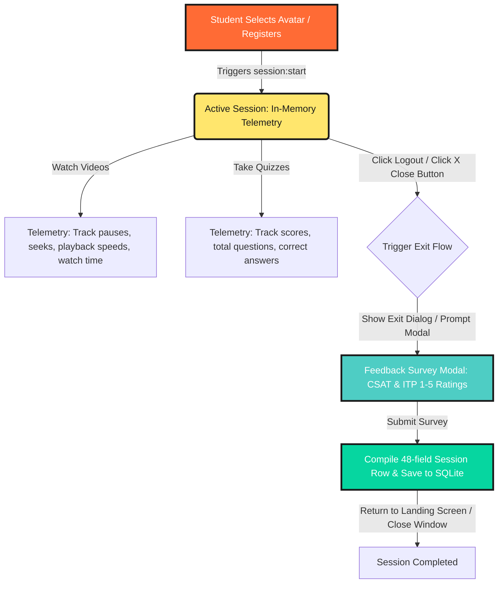
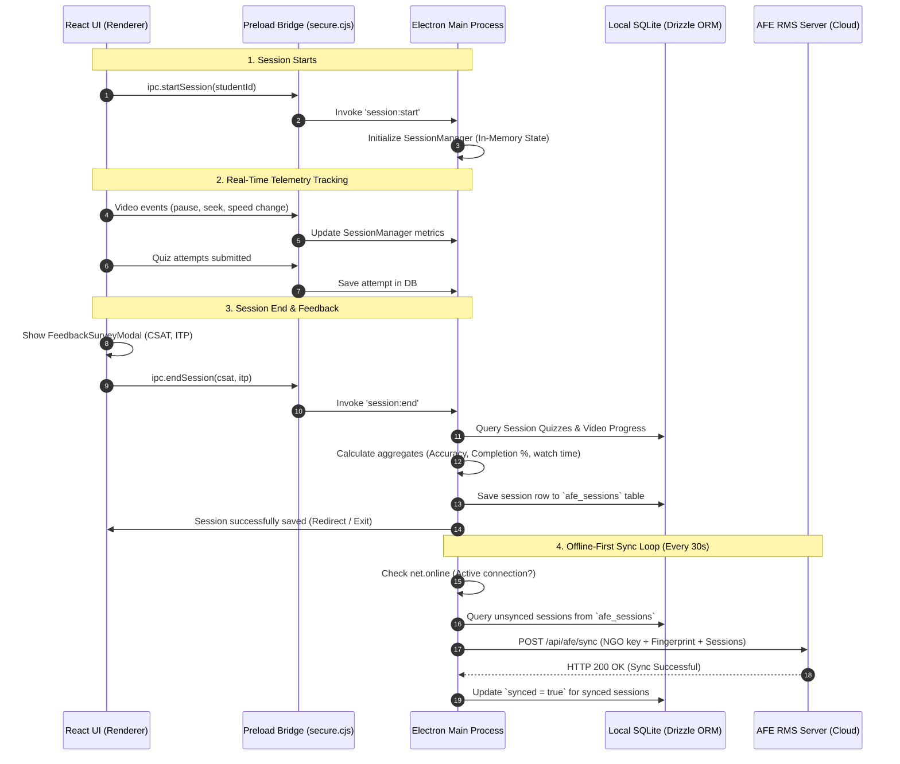
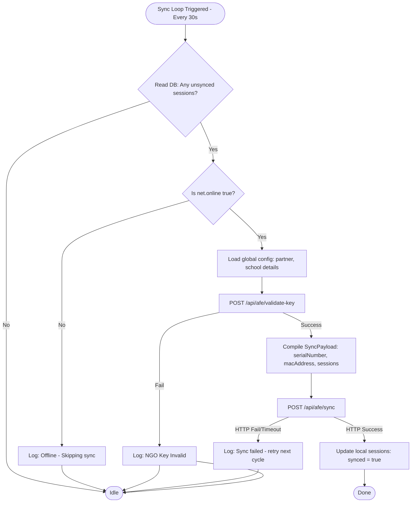

# Amazon Future Engineer (AFE) — Session-Level Tracking & Offline Sync Architecture

This document provides a comprehensive overview of the AFE session tracking and synchronization engine. It covers the high-level flow (for demos and product presentations) as well as the deep technical implementation details (for developers).

---

## 1. 🌟 High-Level Overview (For Demos & Presentations)

### Why Session-Level Tracking?
In rural or shared-device learning environments (e.g. schools, NGOs), multiple students use the same laptop. Tracking metrics by "Daily Snapshots" led to mixed profiles and inaccurate progress records. 
To align with the **AFE Partner Data Collection Guide (Method 2 - Individual Tracking)**, the app tracks and isolates learning telemetry on a **per-student session** basis. 

### The End-to-End Student Session Lifecycle

### Key User Experience Elements in the Demo:
1. **Interactive Grade Selection:** Students select their grade level (5th to 12th) directly on the Profile Setup screen.
2. **Neo-Brutalism Feedback Survey Modal:** Prompts the student on logout or window closure for:
   - **CSAT (Customer Satisfaction):** Enjoyment rating of the Career Tour (1–5 stars).
   - **ITP (Interest to Participate):** Interest in future careers (1–5 rockets).
3. **Graceful Window Closure Interception:** Clicking the window's close ("X") button intercepts termination, prompting the user to log out and provide feedback first so that no telemetry is lost.

---

## 2. 🔌 Technical Architecture & Telemetry Flow

The app is built on **Electron**, dividing logic between the **Main Process** (native capabilities, database, OS details) and the **Renderer Process** (React UI).

---

## 3. 💾 Database Schema (`afe_sessions`)

The `afe_sessions` table compiles the 48 columns required by the AFE Partner Data Collection Guide.

| Column | Type | Description |
| :--- | :--- | :--- |
| `id` | `TEXT` | Primary key: `CT_IN_YYYYMMDD_{SchoolUDISE}_{Grade}_INDIV_{Sequence}` |
| `student_id` | `TEXT` | Foreign key references `students.id` (on cascade delete) |
| `session_date` | `TEXT` | Date of the session (`YYYY-MM-DD`) |
| `start_time` | `TEXT` | ISO timestamp of the start of the session |
| `end_time` | `TEXT` | ISO timestamp of the end of the session |
| `duration_minutes` | `INTEGER` | Session duration in minutes (Calculated on end) |
| `csat_avg` | `REAL` | Enjoyment feedback rating (1–5) |
| `itp_avg` | `REAL` | Interest feedback rating (1–5) |
| `video_completion_rate` | `REAL` | % of total manifest videos watched past 80% |
| `quiz_accuracy_percentage` | `REAL` | % of correct quiz answers submitted during session |
| `avg_watch_time_seconds` | `INTEGER` | Average watch time per video in this session |
| `videos_completed_count` | `INTEGER` | Count of videos completed in this session |
| `quizzes_completed_count` | `INTEGER` | Count of quizzes completed in this session |
| `total_questions_answered` | `INTEGER` | Total quiz questions answered |
| `correct_answers_count` | `INTEGER` | Total correct quiz answers |
| `session_completed_flag` | `BOOLEAN` | True if student completed all video and quiz assets in the database |
| `completion_percentage` | `INTEGER` | Overall progress rate (completions / total manifest assets * 100) |
| `total_watch_time_seconds` | `INTEGER` | Sum of video seconds watched during the session |
| `avg_playback_speed` | `REAL` | Average of playback speeds selected (e.g. `1.25x`) |
| `pause_count_total` | `INTEGER` | Total pauses triggered in video players |
| `seek_count_total` | `INTEGER` | Total seeks triggered in video players |
| `network_type` | `TEXT` | Type of network detected (e.g. `'wifi'`, `'offline'`) |
| `language` | `TEXT` | Student's selected learning language (defaults to `'English'`) |
| `synced` | `BOOLEAN` | Synchronization status flag |
| `created_at` | `TEXT` | ISO creation timestamp |

---

## 4. 🌐 Offline-First Synchronization Engine

The sync service behaves 100% offline-first. Telemetry is saved directly to local storage and successfully queues until a network connection is established.

### Sync Flowchart

---

## 5. 🚪 Close-Interception & Exit Safety Safeguards

If a student attempts to close the window directly (clicking the window's close button or pressing `Alt + F4`), we intercept the action to prevent losing telemetry or orphaned sessions:

1. **`close` Event Interception:** The main process overrides the default window destruction (`e.preventDefault()`).
2. **System Prompt Dialogue:** Displays a native system dialog with the options:
   - **Log Out & Exit:** Flags `SessionManager.closeOnSessionEnd = true` and sends `app:request-logout` to the React app. React pops up the survey modal. When the student submits the survey, the session ends, writes to the DB, and the app terminates.
   - **Exit Immediately:** Bypasses feedback collection, sets `global.isQuitting = true`, and shuts down.
   - **Cancel:** Bypasses exit and remains in the app.
3. **Quit Safeguard:** If the OS forces a shutdown or the app crashes, the `app.on('quit')` hook forces `SessionManager.endSession(null, null)` to run synchronously, ensuring all uncommitted watched seconds and metrics are saved to SQLite.
