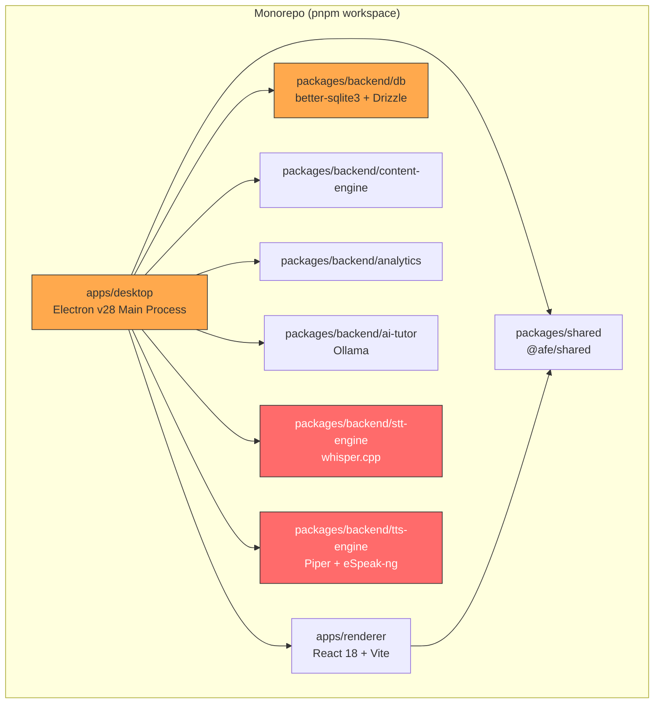
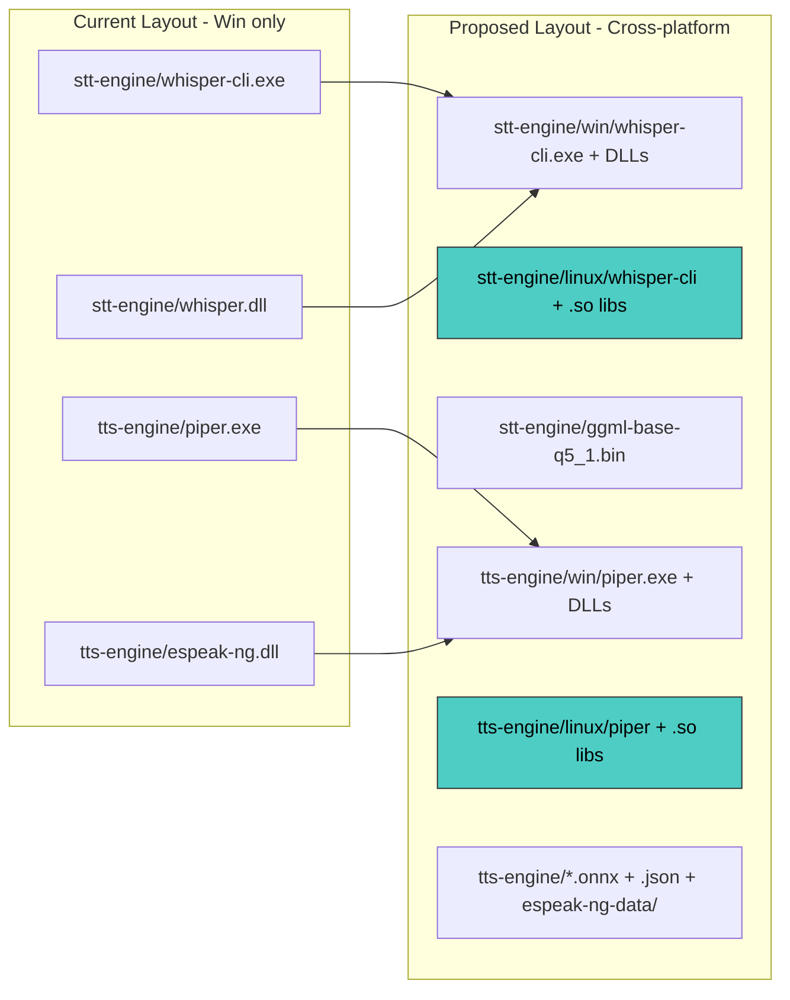
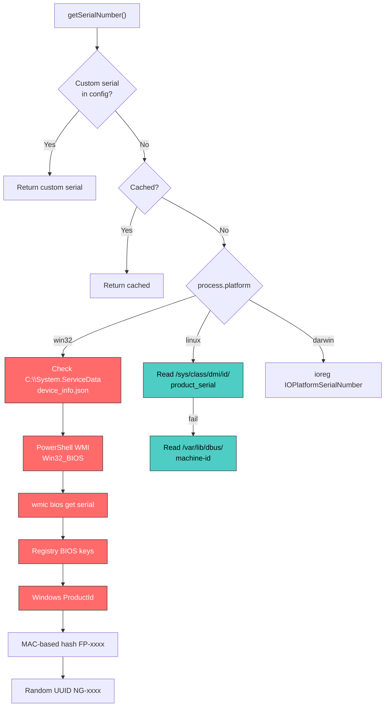
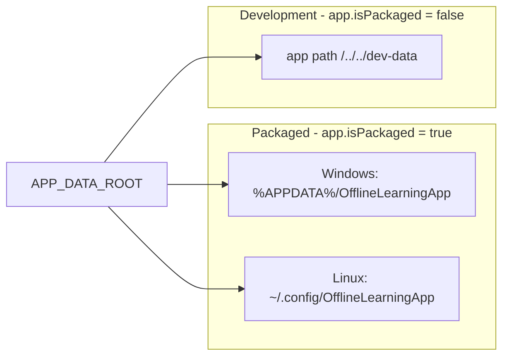
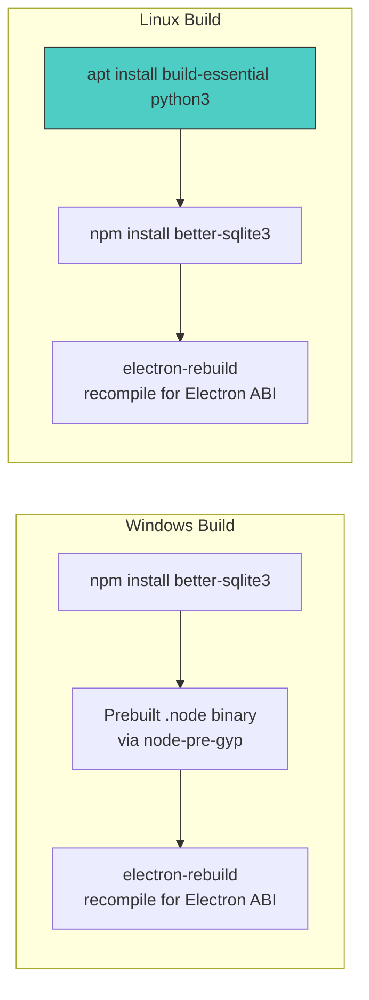
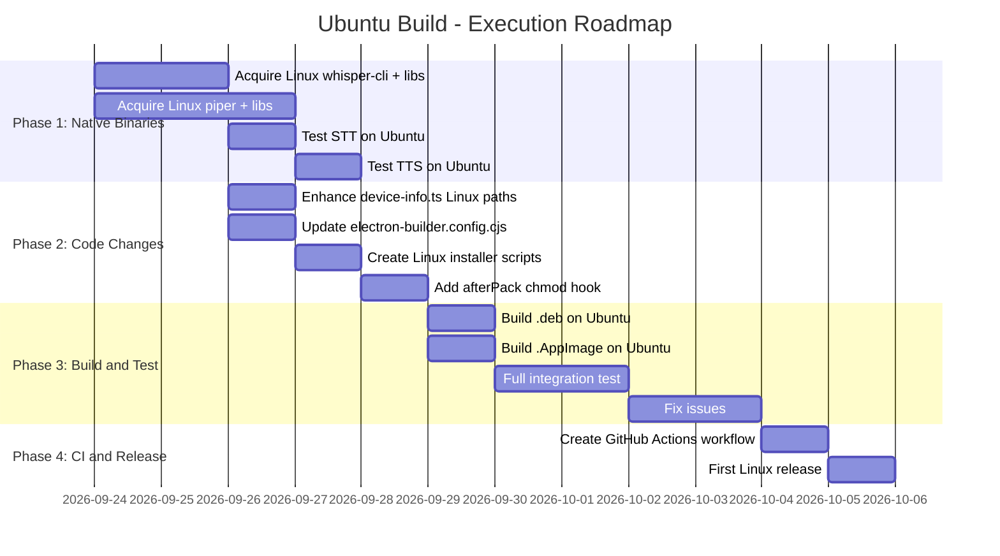

# Ubuntu Build -- AFE Learning App Linux Port Analysis

> **Branch:** `build/linux`
> **Date:** September 2026
> **Scope:** Full audit of every platform-dependent subsystem in the AFE monorepo, with a concrete change list for shipping an Ubuntu `.deb` / `.AppImage` build.

---

## Table of Contents

1. [Architecture Recap](#1-architecture-recap)
2. [Platform Impact Matrix](#2-platform-impact-matrix)
3. [Native Binaries -- STT & TTS Engines](#3-native-binaries----stt--tts-engines)
4. [Device Info & Serial Number Detection](#4-device-info--serial-number-detection)
5. [File System Paths & Data Directories](#5-file-system-paths--data-directories)
6. [RMS Integration Layer (Windows-Only Code)](#6-rms-integration-layer-windows-only-code)
7. [Electron Builder & Installer Configuration](#7-electron-builder--installer-configuration)
8. [NSIS Installer Script Replacement](#8-nsis-installer-script-replacement)
9. [Auto-Updater & Code Signing](#9-auto-updater--code-signing)
10. [Hardware Detection (Low-End Device)](#10-hardware-detection-low-end-device)
11. [Certificates & Trusted Root Authorities](#11-certificates--trusted-root-authorities)
12. [Renderer & Frontend](#12-renderer--frontend)
13. [Database Layer (better-sqlite3)](#13-database-layer-better-sqlite3)
14. [AI Tutor (Ollama)](#14-ai-tutor-ollama)
15. [CI/CD & GitHub Actions](#15-cicd--github-actions)
16. [Linux File Permissions & Execution](#16-linux-file-permissions--execution)
17. [Testing Plan](#17-testing-plan)
18. [Dependency Summary](#18-dependency-summary)
19. [Execution Roadmap](#19-execution-roadmap)

---

## 1. Architecture Recap



> **Red nodes** = contain platform-specific native binaries that **must** be rebuilt for Linux.
> **Orange nodes** = contain platform-conditional logic that needs Linux code paths.

---

## 2. Platform Impact Matrix

| Component | File(s) | Windows-Specific | Linux-Ready | Effort |
|:---|:---|:---:|:---:|:---:|
| **STT Engine (Whisper)** | `packages/backend/stt-engine/` | `whisper-cli.exe`, `whisper.dll`, `SDL2.dll` | `whisper-cli` (ELF exists) | Medium |
| **TTS Engine (Piper)** | `packages/backend/tts-engine/` | `piper.exe`, `espeak-ng.dll`, `onnxruntime.dll`, `piper_phonemize.dll` | No Linux binaries | **High** |
| **Device Info** | `apps/desktop/src/main/device-info.ts` | PowerShell/WMI, Registry, `C:\System.ServiceData` | Partial (`/sys/class/dmi/`) | Medium |
| **Paths** | `apps/desktop/src/main/paths.ts` | `appData` path convention | Cross-platform (Node) | Low |
| **Installer Config** | `electron-builder.config.cjs` | NSIS installer, `.ico` icon | `linux` section exists | Medium |
| **NSIS Script** | `build/installer-script.nsh` | Windows NSIS macros | N/A for Linux | Low |
| **Certificates** | `certs/` | `.pfx`, `.cer`, `.bat` | Not needed for Linux | None |
| **Hardware Detection** | `packages/shared/src/hardware.ts` | `wmic` command | `lspci` (exists) | Low |
| **RMS Store Integration** | `device-info.ts` L42-46, L376-435, L449-482 | `C:\System.ServiceData` | Skip on Linux | Low |
| **Auto Updater** | `apps/desktop/src/main/index.ts` | Authenticode bypass | Needs GPG/no-sign | Low |
| **DB (better-sqlite3)** | `packages/backend/db/` | Prebuilt native addon | Needs `electron-rebuild` | Low |
| **Renderer (React)** | `apps/renderer/` | No platform code | Fully cross-platform | None |
| **AI Tutor (Ollama)** | `packages/backend/ai-tutor/` | Ollama for Windows | Ollama for Linux | Low |
| **Content Engine** | `packages/backend/content-engine/` | No platform code | Fully cross-platform | None |
| **Analytics** | `packages/backend/analytics/` | No platform code | Fully cross-platform | None |

---

## 3. Native Binaries -- STT & TTS Engines

This is the **single biggest blocker** for the Linux build. Both engines ship pre-compiled Windows binaries.

### 3.1 STT Engine (Whisper.cpp)

**Current Windows binaries in `packages/backend/stt-engine/`:**

| File | Size | Purpose |
|:---|:---|:---|
| `whisper-cli.exe` | 113 KB | Whisper CLI executable |
| `whisper.dll` | 671 KB | Whisper shared library |
| `SDL2.dll` | 2.5 MB | Audio I/O library |
| `ggml-base-q5_1.bin` | ~57 MB | Whisper base model (cross-platform) |

**Current Linux binary:**

| File | Size | Purpose |
|:---|:---|:---|
| `whisper-cli` | 2.7 MB | ELF binary (already present!) |

> **GOOD NEWS:** A Linux `whisper-cli` ELF binary already exists in the repo! Verify it's compiled for x86_64 Ubuntu and is dynamically linked correctly.

**Changes needed:**

```diff
# File: packages/backend/stt-engine/index.ts (Line 20-26)
# Already handles Linux via process.platform check for binary extension
# BUT: need to also ship libwhisper.so and libSDL2.so for Linux

# File: packages/backend/stt-engine/index.ts (Line 131-138)
# LD_LIBRARY_PATH handling already exists
```

**Action items:**
1. Verify `whisper-cli` ELF runs on Ubuntu 22.04/24.04
2. Compile or acquire `libwhisper.so` for Linux
3. Ensure `libSDL2-2.0.so` is available (install via `apt` or bundle)
4. Add Linux `.so` files to the repo alongside `.dll` files
5. The `LD_LIBRARY_PATH` code path in `index.ts` L134-137 already handles this

---

### 3.2 TTS Engine (Piper)

**Current Windows binaries in `packages/backend/tts-engine/`:**

| File | Size | Purpose |
|:---|:---|:---|
| `piper.exe` | 510 KB | Piper TTS executable |
| `espeak-ng.dll` | 381 KB | Phonemizer backend |
| `onnxruntime.dll` | 9.3 MB | ONNX inference runtime |
| `onnxruntime_providers_shared.dll` | 22 KB | ONNX providers |
| `piper_phonemize.dll` | 407 KB | Phonemize shared lib |
| `epoch_...indian_culture_30_sent.onnx` | ~60 MB | Voice model (cross-platform) |
| `Spicor_with_indian_cloned.json` | ~7 KB | Voice config (cross-platform) |
| `espeak-ng-data/` | - | eSpeak language data (cross-platform) |

**Linux binaries needed:**

| File | Source |
|:---|:---|
| `piper` (ELF) | Build from [piper GitHub](https://github.com/rhasspy/piper) or download pre-built |
| `libespeak-ng.so` | Build or install via `apt install libespeak-ng1` |
| `libonnxruntime.so` | Download from [ONNX Runtime releases](https://github.com/microsoft/onnxruntime/releases) |
| `libpiper_phonemize.so` | Build from piper-phonemize |

> **CRITICAL:** No Linux TTS binaries exist in the repo. This is the highest-effort item. The ONNX model and eSpeak data are cross-platform, but all 5 native binaries must be acquired for Linux.

**Changes needed:**

```diff
# File: packages/backend/tts-engine/index.ts (Line 38-41)
# Binary selection already handles Linux (no .exe extension)
# Library path setup at L97-100 already handles LD_LIBRARY_PATH
```

**Action items:**
1. Download or compile `piper` for Linux x86_64
2. Download `libonnxruntime.so.1.x` for Linux
3. Compile or package `libpiper_phonemize.so` and `libespeak-ng.so.1`
4. Place all Linux `.so` files in the `tts-engine/` directory
5. Ensure `espeak-ng-data/` is complete (already cross-platform)
6. Set executable permissions on the `piper` binary

---

### Binary Organization Strategy



> An alternative to restructuring is to keep all binaries flat and let `process.platform` resolve the correct filenames (current approach). Since `.exe` and ELF binaries can coexist, this is simpler but messier.

---

## 4. Device Info & Serial Number Detection

**File:** `apps/desktop/src/main/device-info.ts`

### 4.1 Serial Number Detection

The serial number detection has a multi-tier fallback system. Here's the platform breakdown:



> **Linux serial detection already exists** (Lines 257-267). It reads `/sys/class/dmi/id/product_serial` with a fallback to `/var/lib/dbus/machine-id`. However, reading DMI requires `root` or `sudo` on most Ubuntu systems.

**Changes needed:**

```diff
# device-info.ts Lines 257-267 -- Enhance Linux fallback chain
  } else if (process.platform === 'linux') {
      try {
+         // Try product_serial first (requires root or relaxed permissions)
          const serial = fs.readFileSync('/sys/class/dmi/id/product_serial', 'utf8').trim();
-         if (serial && serial !== 'UNKNOWN-SERIAL') cachedSerialNumber = serial;
-         return serial;
+         if (isValidSerial(serial)) {
+             cachedSerialNumber = serial;
+             return serial;
+         }
      } catch (e) {
-         const { stdout } = await execAsync('cat /var/lib/dbus/machine-id');
-         const serial = stdout.trim() || 'UNKNOWN-SERIAL';
-         if (serial !== 'UNKNOWN-SERIAL') cachedSerialNumber = serial;
-         return serial;
+         // Fallback chain for Linux
      }
+     // Try board_serial
+     try {
+         const serial = fs.readFileSync('/sys/class/dmi/id/board_serial', 'utf8').trim();
+         if (isValidSerial(serial)) { cachedSerialNumber = serial; return serial; }
+     } catch {}
+     // Try dmidecode (if available and running with elevated permissions)
+     try {
+         const { stdout } = await execAsync('sudo dmidecode -s system-serial-number', { timeout: 3000 });
+         if (isValidSerial(stdout.trim())) { cachedSerialNumber = stdout.trim(); return stdout.trim(); }
+     } catch {}
+     // Fallback: machine-id
+     try {
+         const machineId = fs.readFileSync('/var/lib/dbus/machine-id', 'utf8').trim()
+             || fs.readFileSync('/etc/machine-id', 'utf8').trim();
+         if (machineId) { cachedSerialNumber = machineId; return machineId; }
+     } catch {}
+     // Final: MAC-based hash
+     const mac = await getMacAddress();
+     if (mac && mac !== 'UNKNOWN-MAC') {
+         const hash = crypto.createHash('sha256').update(mac).digest('hex').slice(0, 8).toUpperCase();
+         cachedSerialNumber = `FP-${hash}`;
+         return cachedSerialNumber;
+     }
+     return 'UNKNOWN-SERIAL';
  }
```

### 4.2 MAC Address Detection

Lines 84-129 -- The MAC address detection uses `os.networkInterfaces()` which is **fully cross-platform**. The Windows-specific RMS cache check (L97-107) is safely gated behind `process.platform === 'win32'`.

**Status:** No changes needed.

---

## 5. File System Paths & Data Directories

**File:** `apps/desktop/src/main/paths.ts`

### Current Path Resolution



**`app.getPath('appData')` resolves to:**

| Platform | Path |
|:---|:---|
| Windows | `%APPDATA%` (e.g., `C:\Users\<user>\AppData\Roaming`) |
| Linux | `~/.config` (XDG_CONFIG_HOME) |
| macOS | `~/Library/Application Support` |

> `paths.ts` uses `app.getPath('appData')` which is already cross-platform via Electron. **No code changes needed** for the path module itself.

**Consideration:** On Linux, `~/.config/OfflineLearningApp` is the data root. This is appropriate for config, but large content (videos, models) might be better placed in `~/.local/share/OfflineLearningApp` (`app.getPath('userData')`). This is a design decision.

---

## 6. RMS Integration Layer (Windows-Only Code)

**File:** `apps/desktop/src/main/device-info.ts`

The RMS (Remote Management System) integration is **deeply Windows-specific**:

| Code Location | What It Does | Linux Impact |
|:---|:---|:---|
| L42-46 | Hardcoded `C:\System.ServiceData` paths | Skipped on Linux (guarded) |
| L97-107 | Read MAC from RMS `device_info.json` | Guarded by `process.platform === 'win32'` |
| L147-161 | Read serial from RMS `device_info.json` | Guarded by `process.platform === 'win32'` |
| L376-435 | Sync custom serial to RMS ServiceData | Guarded by `process.platform === 'win32'` |
| L449-482 | `registerAfeInControlledRmsStore()` | Guarded by `process.platform !== 'win32'` (returns early) |

> **All RMS integration code is already safely gated** behind `process.platform === 'win32'` checks. No changes needed -- Linux simply skips these paths.

**Future consideration:** If you need Linux RMS integration, define a Linux-equivalent data path (e.g., `/opt/navgurukul/service-data/` or `/var/lib/afe/`).

---

## 7. Electron Builder & Installer Configuration

**File:** `apps/desktop/electron-builder.config.cjs`

### Current Linux Config (Lines 65-69)

```javascript
linux: {
    icon: 'build/icon.png',
    target: ['AppImage', 'deb'],
    category: 'Education',
},
```

> The Linux target section already exists with `AppImage` and `deb` targets. However, it needs additional configuration.

**Changes needed:**

```diff
  linux: {
      icon: 'build/icon.png',
      target: ['AppImage', 'deb'],
      category: 'Education',
+     executableName: 'amazon-future-engineer',
+     synopsis: 'Offline-first learning platform by NavGurukul',
+     description: 'Amazon Future Engineer - Offline Learning App for students',
+     desktop: {
+         Name: 'Amazon Future Engineer',
+         Comment: 'Offline Learning Platform',
+         Categories: 'Education;Science;',
+         StartupWMClass: 'amazon-future-engineer',
+     },
  },
+
+ deb: {
+     depends: [
+         'libgtk-3-0',
+         'libnotify4',
+         'libnss3',
+         'libxss1',
+         'libxtst6',
+         'xdg-utils',
+         'libatspi2.0-0',
+         'libuuid1',
+         'libsecret-1-0',
+     ],
+     priority: 'optional',
+     afterInstall: 'build/linux/after-install.sh',
+     afterRemove: 'build/linux/after-remove.sh',
+ },
```

### Build Icons

| Format | Status | Location |
|:---|:---|:---|
| `.ico` (Windows) | Exists | `build/icon.ico` |
| `.png` (Linux/Mac) | Exists | `build/icon.png` |

> Linux requires a `.png` icon, which already exists at `build/icon.png`. However, for proper desktop integration, a multi-resolution icon set (16x16 through 512x512) in PNG format is recommended. Electron Builder handles this automatically from a single 512x512+ PNG.

---

## 8. NSIS Installer Script Replacement

**File:** `build/installer-script.nsh`

NSIS is **Windows-only**. For Linux, we need equivalent post-install/uninstall scripts.

### Linux Post-Install Script (NEW)

**Create:** `build/linux/after-install.sh`

```bash
#!/bin/bash
# AFE Learning App -- Post-Installation Script (Ubuntu/Debian)

# Create app data directory
APP_DATA_DIR="$HOME/.config/OfflineLearningApp"
mkdir -p "$APP_DATA_DIR"

# Write initial config if it doesn't exist (mirrors NSIS customInstall macro)
if [ ! -f "$APP_DATA_DIR/config.json" ]; then
    echo '{"ngoKey": "D3F41T-K37"}' > "$APP_DATA_DIR/config.json"
    echo "Initial config created with default NGO Key."
else
    echo "Existing config.json preserved during update."
fi

# Set executable permissions on native binaries
RESOURCES_DIR="/opt/Amazon Future Engineer/resources"
chmod +x "$RESOURCES_DIR/stt/whisper-cli" 2>/dev/null || true
chmod +x "$RESOURCES_DIR/tts/piper" 2>/dev/null || true

# Update desktop database
update-desktop-database /usr/share/applications 2>/dev/null || true
```

### Linux Post-Remove Script (NEW)

**Create:** `build/linux/after-remove.sh`

```bash
#!/bin/bash
# AFE Learning App -- Post-Removal Script (Ubuntu/Debian)

# Optionally remove app data (equivalent to NSIS deleteAppDataOnUninstall)
if [ "$1" = "purge" ]; then
    rm -rf "$HOME/.config/OfflineLearningApp"
    echo "Application data deleted."
fi
```

---

## 9. Auto-Updater & Code Signing

**File:** `apps/desktop/src/main/index.ts` (Lines 87-117)

### Current Windows-Specific Code

| Feature | Windows | Linux |
|:---|:---|:---|
| `sanitizeAppUpdateConfig()` | Removes `publisherName` from app-update.yml | Same logic works |
| `verifyUpdateCodeSignature` bypass (L117) | Bypasses Authenticode | Not applicable on Linux |
| `autoUpdater.disableWebInstaller` (L114) | Prevents NSIS web installer fallback | N/A on Linux |

**Changes needed:**

```diff
  // Bypass Windows Authenticode signature check for unsigned builds
- (autoUpdater as any).verifyUpdateCodeSignature = () => Promise.resolve(null);
+ if (process.platform === 'win32') {
+     (autoUpdater as any).verifyUpdateCodeSignature = () => Promise.resolve(null);
+ }
```

> `electron-updater` on Linux uses AppImage auto-update or checks GitHub releases for `.deb`. No code signing verification is performed on Linux by default. The GitHub publish config (L97-103) is already provider-agnostic.

---

## 10. Hardware Detection (Low-End Device)

**File:** `packages/shared/src/hardware.ts`

### Status: Already Linux-Compatible

```javascript
// Lines 35-42 -- Linux GPU detection
else {
    // Linux
    const stdout = execSync('lspci | grep -i vga', { ... });
    gpuInfo = stdout.trim();
    if (gpuInfo.toLowerCase().includes('nvidia') || gpuInfo.toLowerCase().includes('radeon')) {
        hasDedicatedGPU = true;
    }
}
```

> GPU detection via `lspci` is already implemented. `lspci` is available on virtually all Ubuntu systems via the `pciutils` package (installed by default).

**Optional improvement:** Also check `lshw -C display` as a fallback if `lspci` is unavailable.

---

## 11. Certificates & Trusted Root Authorities

**Directory:** `certs/`

| File | Purpose | Linux Relevance |
|:---|:---|:---|
| `AFE_CodeSigning.pfx` | Windows code signing certificate | Not used on Linux |
| `AFE_Public.cer` | Public certificate for Windows trusted roots | Not used on Linux |
| `install_certificate.bat` | Batch script to install cert | Windows-only |

> **No changes needed.** Linux does not use Windows Authenticode certificates. If HTTPS pinning is needed, use Linux system CA stores (`/etc/ssl/certs/`).

---

## 12. Renderer & Frontend

**Directory:** `apps/renderer/`

The renderer is a standard React 18 + Vite application with **zero platform-specific code**:

- React, React Router, Lucide icons, React PDF, React Markdown
- Communicates with the main process exclusively via the IPC bridge
- All platform logic is abstracted behind `window.electronAPI.invoke()`

> **No changes needed.** The renderer is fully cross-platform.

---

## 13. Database Layer (better-sqlite3)

**Package:** `packages/backend/db/`

`better-sqlite3` is a native Node.js addon compiled with `node-gyp`. It must be compiled for the target platform's architecture and Node.js/Electron ABI.

### Build Requirements



**Dependencies on Ubuntu:**
```bash
sudo apt install build-essential python3 libsqlite3-dev
```

**Current postinstall hook (package.json L18):**
```json
"postinstall": "pnpm --filter desktop exec electron-rebuild"
```

> `electron-rebuild` is already configured and will automatically recompile `better-sqlite3` for the correct Electron ABI on Linux. Just ensure build tools are installed.

---

## 14. AI Tutor (Ollama)

**Package:** `packages/backend/ai-tutor/`

Ollama is a separate application that runs as a local server. The AI tutor communicates with it via HTTP API.

| Aspect | Windows | Linux |
|:---|:---|:---|
| Installation | `winget install Ollama.Ollama` or MSI | `curl -fsSL https://ollama.ai/install.sh \| sh` |
| Default URL | `http://localhost:11434` | `http://localhost:11434` |
| Model | `qwen2.5:1.5b` | `qwen2.5:1.5b` (same) |
| Service | Runs as background process | `systemd` service or manual |

> The Ollama npm package (`ollama` v0.5.18) is a pure JavaScript HTTP client -- **no native code**. The dependency is the external `ollama` daemon, which must be installed separately on the Linux target machine.

**Action item:** Include Ollama installation in the Linux post-install script or documentation, or bundle the Ollama binary in `extraResources`.

---

## 15. CI/CD & GitHub Actions

No `.github/workflows/` directory currently exists. For automated Linux builds:

### Proposed GitHub Actions Workflow

```yaml
# .github/workflows/build-linux.yml
name: Build Linux Installer

on:
  push:
    branches: [build/linux, main]
    tags: ['v*']

jobs:
  build-linux:
    runs-on: ubuntu-latest
    steps:
      - uses: actions/checkout@v4
      
      - uses: pnpm/action-setup@v4
        with:
          version: 9
          
      - uses: actions/setup-node@v4
        with:
          node-version: 20
          cache: 'pnpm'
          
      - name: Install system deps
        run: |
          sudo apt-get update
          sudo apt-get install -y build-essential python3 libsqlite3-dev
          
      - name: Install dependencies
        run: pnpm install
        
      - name: Build all packages
        run: pnpm build
        
      - name: Build Linux installer
        run: pnpm build:installer --linux
        env:
          CSC_IDENTITY_AUTO_DISCOVERY: false
          
      - name: Upload artifacts
        uses: actions/upload-artifact@v4
        with:
          name: linux-installer
          path: apps/desktop/release/*.{deb,AppImage}
```

---

## 16. Linux File Permissions & Execution

### Native Binary Permissions

Linux requires executable permissions (`chmod +x`) on binary files. Git does not always preserve these.

**Files that need `+x` permission:**

| Binary | Path |
|:---|:---|
| `whisper-cli` | `packages/backend/stt-engine/whisper-cli` |
| `piper` | `packages/backend/tts-engine/piper` (to be added) |

**Fix via `.gitattributes`:**

```diff
# .gitattributes
+ packages/backend/stt-engine/whisper-cli binary
+ packages/backend/tts-engine/piper binary
```

**Fix at build time (electron-builder extraResources):**
Electron Builder's `extraResources` does not preserve Unix permissions. Use an `afterPack` hook:

```javascript
// electron-builder.config.cjs
afterPack: async (context) => {
    if (context.electronPlatformName === 'linux') {
        const { execSync } = require('child_process');
        const resourcesDir = context.appOutDir + '/resources';
        execSync(`chmod +x ${resourcesDir}/stt/whisper-cli || true`);
        execSync(`chmod +x ${resourcesDir}/tts/piper || true`);
    }
},
```

### AppArmor & Sandboxing

Ubuntu may enforce AppArmor profiles that restrict Electron apps. The `--no-sandbox` flag may be needed for AppImage execution:

```diff
# electron-builder.config.cjs
  linux: {
      icon: 'build/icon.png',
      target: ['AppImage', 'deb'],
      category: 'Education',
+     executableArgs: ['--no-sandbox'],
  },
```

---

## 17. Testing Plan

### Unit Test Matrix

| Test Area | What to Verify | Priority |
|:---|:---|:---|
| STT Engine | `whisper-cli` transcribes audio on Linux | P0 |
| TTS Engine | `piper` generates WAV on Linux | P0 |
| Serial Number | `/sys/class/dmi/` reading works | P1 |
| MAC Address | `os.networkInterfaces()` returns valid MAC | P1 |
| Database | `better-sqlite3` opens/reads/writes on Linux | P0 |
| Auto-Updater | GitHub release detection works on Linux | P2 |
| Content Loading | Manifest + video playback works | P1 |
| File Paths | `~/.config/OfflineLearningApp/` created correctly | P1 |
| Installer | `.deb` installs cleanly on Ubuntu 22.04/24.04 | P0 |
| AppImage | AppImage launches and runs correctly | P1 |

### Manual Testing Checklist

- [ ] App launches on clean Ubuntu 22.04 LTS
- [ ] App launches on clean Ubuntu 24.04 LTS
- [ ] Student creation and profile selection works
- [ ] Video playback via `media://` protocol works
- [ ] STT (Speech-to-Text) push-to-talk works with microphone
- [ ] TTS (Text-to-Speech) reads text aloud
- [ ] AI Tutor (Ollama) responds to prompts
- [ ] Database persists across app restarts
- [ ] Auto-update downloads and applies update
- [ ] `.deb` installer works via `sudo dpkg -i`
- [ ] AppImage works without installation
- [ ] Uninstall removes the app cleanly

---

## 18. Dependency Summary

### System Dependencies for Ubuntu Build Machine

```bash
# Build-time dependencies
sudo apt update && sudo apt install -y \
    build-essential \
    python3 \
    libsqlite3-dev \
    git \
    curl \
    rpm              # For RPM target (optional)

# Runtime dependencies (bundled or required on target)
sudo apt install -y \
    libgtk-3-0 \
    libnotify4 \
    libnss3 \
    libxss1 \
    libxtst6 \
    xdg-utils \
    libatspi2.0-0 \
    libuuid1 \
    libsecret-1-0 \
    libasound2      # For audio (STT/TTS)
```

### Node.js / pnpm Requirements

| Tool | Version |
|:---|:---|
| Node.js | >= 20.0.0 |
| pnpm | >= 8.0.0 |
| Electron | 28.x |
| electron-builder | 24.x |

---

## 19. Execution Roadmap



### Priority Order

| Priority | Task | Impact |
|:---|:---|:---|
| **P0** | Acquire and test Linux Piper (TTS) binaries | Blocker -- no TTS without this |
| **P0** | Verify Linux whisper-cli works | Blocker -- no STT without this |
| **P0** | Test `better-sqlite3` + `electron-rebuild` on Linux | Blocker -- no data persistence |
| **P1** | Update `electron-builder.config.cjs` with full Linux config | Required for packaging |
| **P1** | Create `after-install.sh` / `after-remove.sh` scripts | Required for `.deb` |
| **P1** | Add `afterPack` hook for `chmod +x` on binaries | Required for native binaries |
| **P2** | Enhance `device-info.ts` Linux serial fallback chain | Nice-to-have robustness |
| **P2** | Create GitHub Actions CI workflow | Automated builds |
| **P3** | Guard `verifyUpdateCodeSignature` behind `win32` check | Clean code |
| **P3** | Ollama installation documentation for Linux | Deployment guide |

---

> **Bottom line:** The app is ~85% cross-platform already thanks to Electron + Node.js abstractions. The **critical blockers** are the native TTS binaries (Piper) which don't have Linux equivalents in the repo, and validating that the existing Linux whisper-cli binary works. Everything else is configuration and minor code adjustments.
