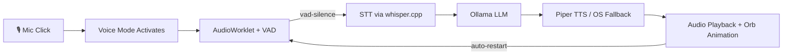

# TTS Engine

This package provides offline Text-to-Speech (TTS) capabilities using [Piper TTS](https://github.com/rhasspy/piper). It also includes a fallback mechanism to the browser's Web Speech API if Piper is not available.

## Architecture

Implemented as part of a full offline voice interaction system for the AI Tutor.



### Flow Detail
1. **Trigger**: Student clicks the mic button in `AILearningCenter.tsx`.
2. **Overlay**: The `VoiceOrb` component appears, and the `useVoiceMode` hook initializes the microphone.
3. **VAD**: An `AudioWorklet` (`stt-worklet.js`) monitors audio levels and sends a `vad-silence` event after a period of silence (default 1.2s).
4. **Transcription**: The recorded audio is sent to the `stt-engine` (whisper.cpp) for processing.
5. **Generation**: The transcript is sent to Ollama to generate an AI response.
6. **Synthesis**: The response text is sent via IPC to this package, which runs `piper.exe` to generate a WAV buffer.
7. **Playback**: The WAV buffer is played back in the renderer using the Web Audio API, driving the `VoiceOrb` animations.
8. **Loop**: Once playback ends, the system automatically transitions back to "listening" mode.

## Installation & Setup

To enable high-quality offline voices, you must manually add the Piper binaries and models to this directory.

### 1. Piper Binaries
1. Download the Windows release from [Piper Releases](https://github.com/rhasspy/piper/releases).
2. Extract and place `piper.exe` and all required `.dll` files in this folder (`packages/backend/tts-engine/`).

### 2. Voice Models
1. Choose a voice from the [Piper Voice Samples](https://rhasspy.github.io/piper-samples/).
2. Download both the `.onnx` and `.onnx.json` files for your chosen voice.
3. Place them in this folder (`packages/backend/tts-engine/`).

### File Structure Example
```
packages/backend/tts-engine/
├── piper.exe
├── libonmicrosoft.dll (and others)
├── en_US-lessac-medium.onnx
├── en_US-lessac-medium.onnx.json
├── index.ts
├── package.json
└── README.md
```

## Known Issues & Fixes

### Custom-trained model fails silently (`Piper execution error: Command failed`)

**Symptom:** Piper binary and model are detected (`bin=true`, `model=true`), but synthesis fails with a generic `Command failed` error and no stderr output.

**Root Cause:** Two missing CLI arguments when using custom-trained `.onnx` models:

1. **Missing `--config` flag:** Piper auto-discovers the model config JSON only if it follows the naming convention `<model_name>.onnx.json` (e.g., `en_US-lessac-medium.onnx.json`). Our custom model config is named `Spicor_with_indian_cloned.json`, which Piper cannot auto-discover. The `--config` flag must be passed explicitly.

2. **Missing `--espeak_data` flag:** The model uses espeak-ng for phonemization (`"phoneme_type": "espeak"` in the config). While the code set the `ESPEAK_DATA_PATH` environment variable, Piper on Windows does not always respect it. The `--espeak_data` CLI flag is required to point Piper to the `espeak-ng-data/` directory.

**Fix applied in `index.ts`:**
- Added `getConfigPath()` helper that auto-discovers the config JSON (tries `<model>.onnx.json` first, then falls back to any non-package JSON in the directory).
- Added `--config` and `--espeak_data` CLI flags to the Piper invocation.

## Fallback
If `piper.exe` or a `.onnx` model is not found, the system will automatically fall back to the browser's `window.speechSynthesis` (Web Speech API).
