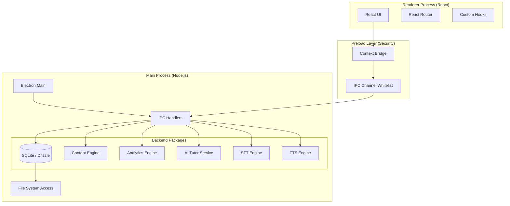

# Project Overview: Amazon Future Engineers (AFE)

## Core Mission
To provide a robust, resilient, and offline-first Learning Management System (LMS) for students with limited internet connectivity. The app delivers high-quality educational content (videos, interactive quizzes, readings) and AI-powered tutoring via a secure Electron desktop environment that runs entirely on local assets.

## Technology Stack
-   **Monorepo Manager:** `pnpm`
-   **Desktop Engine:** Electron (v28+) with strict Security Sandbox.
-   **Frontend:** React (Vite), TypeScript, TailwindCSS (Neo-Brutalism aesthetics).
-   **Backend (Local):** Node.js main process.
-   **Database:** SQLite via `better-sqlite3`.
-   **ORM:** Drizzle ORM (for local migrations and type-safe queries).
-   **AI Engines:** Ollama (LLM), Whisper.cpp (STT), Piper ONNX (TTS).
-   **Inter-Process Communication:** Type-safe IPC bridge (`contextBridge`) with strict channel validation.

## Architecture

## Data Management Strategy

### 1. Content (Read-Only)
-   **Structure:** Content is defined in a `manifest.json` file.
-   **Storage**:
    -   **Production:** `C:\ProgramData\OfflineLearningApp\content\` (Installed by installer).
    -   **Development:** `[RepoRoot]/dev-data/content/` (Local override).
-   **Format:** Static assets (MP4, PDF, JSON).

### 2. User Data (Read/Write)
-   **Database:** Single SQLite file (`data.db`) stored in `C:\ProgramData\OfflineLearningApp\` (or `dev-data` in dev).
-   **Schema:** 
    -   `students`: Profiles & Avatars.
    -   `video_progress`: Watch time & completion status.
    -   `quiz_attempts`: Scores & answers.
    -   `analytics_events`: Local telemetry.
    -   `ai_chat_history`: Persistent AI interactions.

## Current Progress Status

| Component | Status | Details |
| :--- | :--- | :--- |
| **Monorepo** | ✅ Complete | pnpm workspace set up with `apps` and `packages`. |
| **Database** | ✅ Complete | Schema defined, Migrations working, Drizzle configured. |
| **Content Engine** | ✅ Complete | Loads/Validates `manifest.json`, serves static files. |
| **Security** | ✅ Complete | IPC Context Isolation, Channel Whitelisting, no Node in Renderer. |
| **Student Mgmt** | ✅ Complete | Backend APIs and UI for creating/switching students finalized. |
| **UI Framework** | ✅ Complete | Foundation, routing, and Neo-Brutalism theme implemented. |
| **AI Tutor** | ✅ Complete | Offline Ollama integration including Voice Mode (STT/TTS). |
| **Sync Engine** | ✅ Complete | Daily snapshotting and RM-centric cloud sync logic ready. |

## Future Implementation Roadmap

1.  **Multi-Language Content**: Support for localized content and AI models.
2.  **Advanced VAD**: Dynamic background noise reduction for classroom environments.
3.  **Cross-Platform Installer**: Linux-based installers for varied hardware deployments.
4.  **Local CMS**: Mentor-focused dashboard for easy manifest updates.

## Key Constraints
-   **Offline-First:** The app MUST function 100% without internet.
-   **Windows-First:** Primary target OS (hardcoded paths for Windows `C:\ProgramData`).
-   **Resource Conscious:** Optimized AI threads for low-end hardware.
