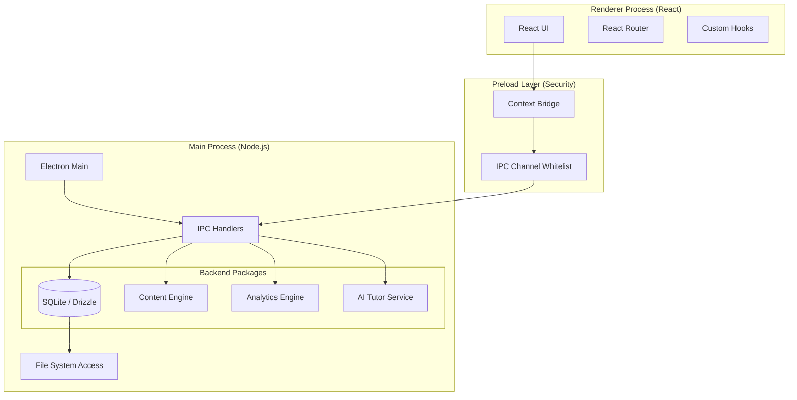

# Project Overview: Offline-First Learning App

## Core Mission
To provide a robust, resilient, and offline-first Learning Management System (LMS) for students with limited internet connectivity. The app delivers high-quality educational content (videos, interactive quizzes, readings) via a secure Electron desktop environment that primarily runs from static assets installed on the device.

## Technology Stack
-   **Monorepo Manager:** `pnpm`
-   **Desktop Engine:** Electron (v28+) with strict Security Sandbox.
-   **Frontend:** React (Vite), TypeScript, TailwindCSS (Neo-Brutalism aesthetics).
-   **Backend (Local):** Node.js main process.
-   **Database:** SQLite via `better-sqlite3`.
-   **ORM:** Drizzle ORM (for local migrations and type-safe queries).
-   **Inter-Process Communication:** Type-safe IPC bridge (`contextBridge`) with strict channel validation.

## Architecture

## Data Management Strategy

### 1. Content (Read-Only)
-   **Structure:** Content is defined in a `manifest.json` file.
-   **Storage**:
    -   **Production:** `C:\ProgramData\OfflineLearningApp\content\` (Installed by installer).
    -   **Development:** `[RepoRoot]/dev-data/content/` (Local override).
-   **Format:** Static assets (MP4, PDF, JSON).

### 2. User Data (Read/Write)
-   **Database:** Single SQLite file (`data.db`) stored in `C:\ProgramData\OfflineLearningApp\` (or `dev-data` in dev).
-   **Schema:** 
    -   `students`: Profiles & Avatars.
    -   `video_progress`: Watch time & completion status.
    -   `quiz_attempts`: Scores & answers.
    -   `analytics_events`: Local telemetry.

## Current Progress Status

| Component | Status | Details |
| :--- | :--- | :--- |
| **Monorepo** | ✅ Complete | pnpm workspace set up with `apps` and `packages`. |
| **Database** | ✅ Complete | Schema defined, Migrations working, Drizzle configured. |
| **Content Engine** | ✅ Complete | Loads/Validates `manifest.json`, serves static files. |
| **Security** | ✅ Complete | IPC Context Isolation, Channel Whitelisting, no Node in Renderer. |
| **Dev Workflow** | ✅ Complete | Local `dev-data` mapping implemented for easier testing. |
| **Student Mgmt** | 🏗️ In Progress | Backend APIs ready (`createStudent`, `getAll`). UI partially started. |
| **UI Framework** | 🏗️ In Progress | Router setup, basic Layouts. Needs Component Library polish. |
| **AI Tutor** | ⏳ Pending | Interface defined, but logic needs Ollama/Local LLM hookup. |
| **Sync Engine** | ⏳ Pending | Schema exists (`sync_queue`), but cloud sync logic is effectively TODO. |

## Future Implementation Roadmap

1.  **Student Dashboard UI:** Finish the "Neo-Brutalism" implementation of the student profile and progress dashboard.
2.  **Video Player:** Implement a custom video player that interacts with the `video_progress` table (verify watch time).
3.  **Quiz Runner:** Build the interactive quiz logic in React that submits attempts via IPC.
4.  **AI Tutor Integration:** Connect the backend `ai-tutor` package to a local inference engine (Ollama) or API.
5.  **Analytics Utilization:** Visualize the local `analytics_events` data for the user.
6.  **Cloud Sync:** Implement the logic to push `sync_queue` items to a cloud backend when internet is available.
7.  **Installer:** Configure `electron-builder` (NSIS) to correctly place assets in `ProgramData` during install.

## Key Constraints
-   **Offline-First:** The app MUST function 100% without internet.
-   **Windows Only:** Primary target OS (FileSystem paths hardcoded for Windows `C:\ProgramData`).
-   **Performance:** UI must be snappy (React) even on lower-end hardware.
